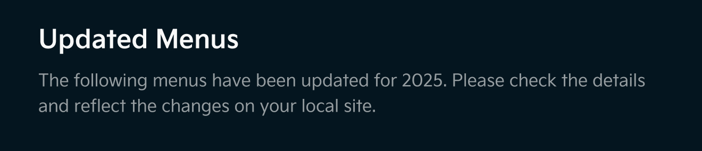
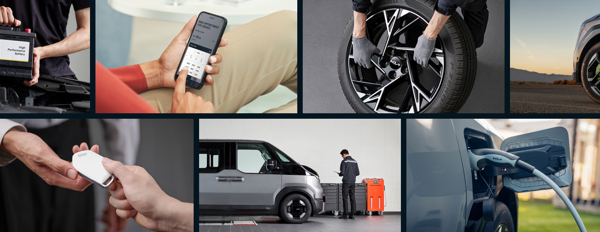
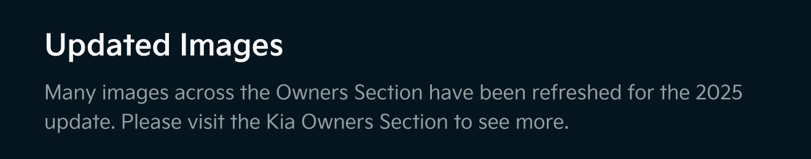
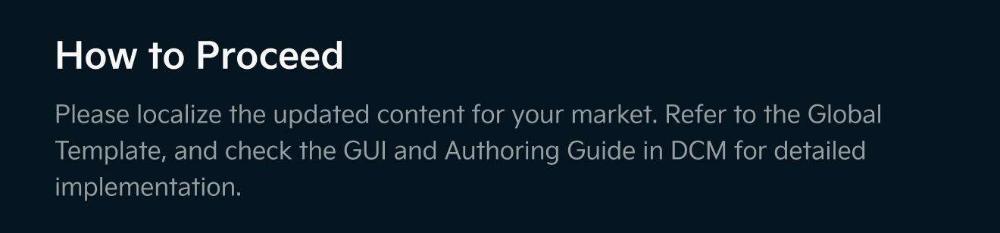

# 11 prompt

11월 프롬프트 vr.01

뉴스레터를 html로 보낼거고, 사용자는 gmail, naver mail 등 메일 앱을 통해 확인할거야 다크모드 / 라이트모드 어떤 모드에서 확인하던 뉴스레터가 정상적으로 보여지면 좋겠고 이미지 테이블이 깨져서 흰선이 생기는 경우는 없으면 좋겠어. 그리고 max widh 660px 밖으로는 메일의 기본 배경이 보여지면 좋겠어. 즉 뉴스레터의 배경색이 연장되어 좌, 우로 보여지지 않았으면 좋겠다는 얘기야. max width값은 660px이고 min width값은 360px으로, 660을 기준으로 브라우저가 줄어들면 %로 이미지를 같이 줄이고 싶어. 링크가 걸려야 하는 버튼만 클릭되도록 이미지를 테이블형태로 잘랐고, 정렬은 내가 첨부한 시안처럼 모바일/PC 동일하게 정렬되면 좋겠어. 링크가 걸리지 않는 이미지들은 클릭되거나, 마우스 hover 시 커서가 손가락모양으로 바뀌지 않게 해줘. 각 이미지 url은 아래와 같아.&#x20;

01 logo - 660x105 https://images.gitbook.com/\_\_img/dpr=2,width=2400,onerror=redirect,format=auto,signature=1340640983/https%3A%2F%2Ffiles.gitbook.com%2Fv0%2Fb%2Fgitbook-x-prod.appspot.com%2Fo%2Fspaces%252Fw5lfZjNS4U8oixK11ksH%252Fuploads%252Fgp7S72dr385pIGmStIEy%252F01-logo-660x105.jpg%3Falt%3Dmedia%26token%3D6013dff8-0b34-449a-b91e-788e430902cc&#x20;

02 img - 660x375 https://images.gitbook.com/\_\_img/dpr=2,width=2400,onerror=redirect,format=auto,signature=-673304902/https%3A%2F%2Ffiles.gitbook.com%2Fv0%2Fb%2Fgitbook-x-prod.appspot.com%2Fo%2Fspaces%252Fw5lfZjNS4U8oixK11ksH%252Fuploads%252FX4TfSGBdoriq16qUemqd%252F02-img-tasman.jpg%3Falt%3Dmedia%26token%3D62a57603-d27b-4ef8-bc88-b1e68f97258f&#x20;

03 - 660x256 https://images.gitbook.com/\_\_img/dpr=2,width=2400,onerror=redirect,format=auto,signature=2044303265/https%3A%2F%2Ffiles.gitbook.com%2Fv0%2Fb%2Fgitbook-x-prod.appspot.com%2Fo%2Fspaces%252Fw5lfZjNS4U8oixK11ksH%252Fuploads%252FuYcthRrRbPF1uTDgVjIT%252F03-11%2520text-660x256.jpg%3Falt%3Dmedia%26token%3Dbb0004ef-5cab-480e-89eb-85795b4119ca&#x20;

04번 이미지들 높이값 같음. 반드시 병렬 정렬&#x20;

04-1 36x40 https://images.gitbook.com/\_\_img/dpr=2,width=2400,onerror=redirect,format=auto,signature=-403456806/https%3A%2F%2Ffiles.gitbook.com%2Fv0%2Fb%2Fgitbook-x-prod.appspot.com%2Fo%2Fspaces%252Fw5lfZjNS4U8oixK11ksH%252Fuploads%252FlwktUCeAvN0Skc1NfgkK%252F04-1.jpg%3Falt%3Dmedia%26token%3D21e12c13-d0ac-4bac-9fa3-e10c57319460&#x20;

04-2 button 212x40 https://images.gitbook.com/\_\_img/dpr=2,width=2400,onerror=redirect,format=auto,signature=-1922636328/https%3A%2F%2Ffiles.gitbook.com%2Fv0%2Fb%2Fgitbook-x-prod.appspot.com%2Fo%2Fspaces%252Fw5lfZjNS4U8oixK11ksH%252Fuploads%252FIq9LvBaaCY0e0GQR7WE1%252F04-2-button.jpg%3Falt%3Dmedia%26token%3D69ce491e-728b-4415-9b5e-aab8bda3a2e0&#x20;

링크: https://kia-ownership.gitbook.io/kia-ownership-marketing-hub/&#x20;

04-3 412x40 https://images.gitbook.com/\_\_img/dpr=2,width=2400,onerror=redirect,format=auto,signature=79667709/https%3A%2F%2Ffiles.gitbook.com%2Fv0%2Fb%2Fgitbook-x-prod.appspot.com%2Fo%2Fspaces%252Fw5lfZjNS4U8oixK11ksH%252Fuploads%252F3ryvTqHV4ATKSQ4ThIN4%252F04-3.jpg%3Falt%3Dmedia%26token%3De24c0453-4f31-443d-bf12-215184144cb2&#x20;

05 660x96 https://images.gitbook.com/\_\_img/dpr=2,width=2400,onerror=redirect,format=auto,signature=-513895100/https%3A%2F%2Ffiles.gitbook.com%2Fv0%2Fb%2Fgitbook-x-prod.appspot.com%2Fo%2Fspaces%252Fw5lfZjNS4U8oixK11ksH%252Fuploads%252FxCK6enRKEr8udfNBulCI%252F05-title.jpg%3Falt%3Dmedia%26token%3Dd59f9d08-5d8f-4d7a-ba4d-682de18b8fa7&#x20;

06번 이미지들 모두 높이값 같음. 반드시 병렬 정렬&#x20;

06-1 36x161 https://images.gitbook.com/\_\_img/dpr=2,width=2400,onerror=redirect,format=auto,signature=-78325955/https%3A%2F%2Ffiles.gitbook.com%2Fv0%2Fb%2Fgitbook-x-prod.appspot.com%2Fo%2Fspaces%252Fw5lfZjNS4U8oixK11ksH%252Fuploads%252Fxc7BAKo048Fo0TNlifek%252F

06-1-36x161.jpg%3Falt%3Dmedia%26token%3Da900236d-dabf-497f-ab31-86b03696e12e&#x20;

06-2 558x161 https://images.gitbook.com/\_\_img/dpr=2,width=2400,onerror=redirect,format=auto,signature=1366381647/https%3A%2F%2Ffiles.gitbook.com%2Fv0%2Fb%2Fgitbook-x-prod.appspot.com%2Fo%2Fspaces%252Fw5lfZjNS4U8oixK11ksH%252Fuploads%252FsSWigj9sPKIWoi3YnYTJ%252F06-2-558x161.jpg%3Falt%3Dmedia%26token%3Ddf46a7ef-4730-42b1-8cc5-4bacbbe169e3&#x20;

06-1 36x161 https://images.gitbook.com/\_\_img/dpr=2,width=2400,onerror=redirect,format=auto,signature=-78325955/https%3A%2F%2Ffiles.gitbook.com%2Fv0%2Fb%2Fgitbook-x-prod.appspot.com%2Fo%2Fspaces%252Fw5lfZjNS4U8oixK11ksH%252Fuploads%252Fxc7BAKo048Fo0TNlifek%252F06-1-36x161.jpg%3Falt%3Dmedia%26token%3Da900236d-dabf-497f-ab31-86b03696e12e&#x20;

07 660x83 https://images.gitbook.com/\_\_img/dpr=2,width=2400,onerror=redirect,format=auto,signature=433387415/https%3A%2F%2Ffiles.gitbook.com%2Fv0%2Fb%2Fgitbook-x-prod.appspot.com%2Fo%2Fspaces%252Fw5lfZjNS4U8oixK11ksH%252Fuploads%252FCb9VGwHPniU6wSIkSWNd%252F09-line.jpg%3Falt%3Dmedia%26token%3Df10347d4-e1ac-452e-87f6-1e2367576b47&#x20;

08번 이미지 높이값 같음. 반드시 병렬 정렬&#x20;

08-1 510x30 https://images.gitbook.com/\_\_img/dpr=2,width=2400,onerror=redirect,format=auto,signature=-1920292617/https%3A%2F%2Ffiles.gitbook.com%2Fv0%2Fb%2Fgitbook-x-prod.appspot.com%2Fo%2Fspaces%252Fw5lfZjNS4U8oixK11ksH%252Fuploads%252FQGIbq4G4dN14cUtgCnmc%252F10-1.jpg%3Falt%3Dmedia%26token%3D79f25d91-6e74-4e02-a7a5-a33f9aceb661&#x20;

08-2 38x30 https://images.gitbook.com/\_\_img/dpr=2,width=2400,onerror=redirect,format=auto,signature=-448427952/https%3A%2F%2Ffiles.gitbook.com%2Fv0%2Fb%2Fgitbook-x-prod.appspot.com%2Fo%2Fspaces%252Fw5lfZjNS4U8oixK11ksH%252Fuploads%252F9BoSiRA3irAlmGWmFDYe%252F10-2-facebook.jpg%3Falt%3Dmedia%26token%3D64f78482-e0e1-4fc5-94d9-77a60df3b852 Link: https://www.facebook.com/profile.php?id=61580071610715&#x20;

08-3 38x30 https://images.gitbook.com/\_\_img/dpr=2,width=2400,onerror=redirect,format=auto,signature=-506913088/https%3A%2F%2Ffiles.gitbook.com%2Fv0%2Fb%2Fgitbook-x-prod.appspot.com%2Fo%2Fspaces%252Fw5lfZjNS4U8oixK11ksH%252Fuploads%252FTmLNSNnG2H6PP0LkS5gi%252F10-3-instagram.jpg%3Falt%3Dmedia%26token%3D54421382-0e5e-4355-8c92-e8e34223952e Link: https://www.instagram.com/kiaownership/&#x20;

08-4 38x30 https://images.gitbook.com/\_\_img/dpr=2,width=2400,onerror=redirect,format=auto,signature=-1879220480/https%3A%2F%2Ffiles.gitbook.com%2Fv0%2Fb%2Fgitbook-x-prod.appspot.com%2Fo%2Fspaces%252Fw5lfZjNS4U8oixK11ksH%252Fuploads%252FiSzSLKTQqBkUAk1PyVpw%252F10-4-x.jpg%3Falt%3Dmedia%26token%3Da2156898-308c-4274-b937-8fe1c086e574 Link: https://x.com/KiaOwnership&#x20;

08-5 36x30 https://images.gitbook.com/\_\_img/dpr=2,width=2400,onerror=redirect,format=auto,signature=1431677260/https%3A%2F%2Ffiles.gitbook.com%2Fv0%2Fb%2Fgitbook-x-prod.appspot.com%2Fo%2Fspaces%252Fw5lfZjNS4U8oixK11ksH%252Fuploads%252FYAjVLmTcnLjgkh7JU6VL%252F10-5.jpg%3Falt%3Dmedia%26token%3D41e27329-4ecc-4799-b4d6-70f2bfe8e218&#x20;

09 660x119 https://images.gitbook.com/\_\_img/dpr=2,width=2400,onerror=redirect,format=auto,signature=-142799310/https%3A%2F%2Ffiles.gitbook.com%2Fv0%2Fb%2Fgitbook-x-prod.appspot.com%2Fo%2Fspaces%252Fw5lfZjNS4U8oixK11ksH%252Fuploads%252Fs1jJo2nZIGHaHGu5dRE5%252F11-questions.jpg%3Falt%3Dmedia%26token%3Dee10e27c-31ca-405a-8fcc-2b2e99c5d309&#x20;

10번 이미지들 높이값 같음. 반드시 병렬 정렬&#x20;

10-1 36x98 https://images.gitbook.com/\_\_img/dpr=2,width=2400,onerror=redirect,format=auto,signature=1084812966/https%3A%2F%2Ffiles.gitbook.com%2Fv0%2Fb%2Fgitbook-x-prod.appspot.com%2Fo%2Fspaces%252Fw5lfZjNS4U8oixK11ksH%252Fuploads%252Fw1AHlCyGfAc6Ho7xZED8%252F12-1.jpg%3Falt%3Dmedia%26token%3D6999d150-b293-4111-bde9-b9c29b6a05c6&#x20;

10-2 289x98 https://images.gitbook.com/\_\_img/dpr=2,width=2400,onerror=redirect,format=auto,signature=-1255899121/https%3A%2F%2Ffiles.gitbook.com%2Fv0%2Fb%2Fgitbook-x-prod.appspot.com%2Fo%2Fspaces%252Fw5lfZjNS4U8oixK11ksH%252Fuploads%252F7MyHj0e78rM4cLhRdDPo%252F12-2-email.jpg%3Falt%3Dmedia%26token%3D71b46be8-8925-4c31-a44d-9a87e5b7711f&#x20;

10-3 10x98 https://images.gitbook.com/\_\_img/dpr=2,width=2400,onerror=redirect,format=auto,signature=-293280300/https%3A%2F%2Ffiles.gitbook.com%2Fv0%2Fb%2Fgitbook-x-prod.appspot.com%2Fo%2Fspaces%252Fw5lfZjNS4U8oixK11ksH%252Fuploads%252FITSS1twwe1XEnHgRITxv%252F12-3.jpg%3Falt%3Dmedia%26token%3D694fd79f-1767-4dee-8860-664da5565e61&#x20;

10-4 289x98 https://images.gitbook.com/\_\_img/dpr=2,width=2400,onerror=redirect,format=auto,signature=132195475/https%3A%2F%2Ffiles.gitbook.com%2Fv0%2Fb%2Fgitbook-x-prod.appspot.com%2Fo%2Fspaces%252Fw5lfZjNS4U8oixK11ksH%252Fuploads%252Fu9K6IbZouIyu5apSGPGU%252F12-4-email.jpg%3Falt%3Dmedia%26token%3Deabbfe55-90ad-463d-b430-38728848c0b3&#x20;

10-1 36x98 https://images.gitbook.com/\_\_img/dpr=2,width=2400,onerror=redirect,format=auto,signature=1084812966/https%3A%2F%2Ffiles.gitbook.com%2Fv0%2Fb%2Fgitbook-x-prod.appspot.com%2Fo%2Fspaces%252Fw5lfZjNS4U8oixK11ksH%252Fuploads%252Fw1AHlCyGfAc6Ho7xZED8%252F12-1.jpg%3Falt%3Dmedia%26token%3D6999d150-b293-4111-bde9-b9c29b6a05c6&#x20;

11 https://images.gitbook.com/\_\_img/dpr=2,width=2400,onerror=redirect,format=auto,signature=-546826000/https%3A%2F%2Ffiles.gitbook.com%2Fv0%2Fb%2Fgitbook-x-prod.appspot.com%2Fo%2Fspaces%252Fw5lfZjNS4U8oixK11ksH%252Fuploads%252FxhLuDjJBtsulqqEvLmol%252F13.jpg%3Falt%3Dmedia%26token%3D8cd1cea5-8800-4eba-a49e-93fa57815e4a

Owners 메뉴 이미지 업로드

<figure><figcaption></figcaption></figure> <figure><figcaption></figcaption></figure> <figure><figcaption></figcaption></figure> <figure><figcaption></figcaption></figure> <figure><figcaption></figcaption></figure> <figure><figcaption></figcaption></figure> <figure><figcaption></figcaption></figure> <figure><figcaption></figcaption></figure> <figure><figcaption></figcaption></figure> <figure><figcaption></figcaption></figure> <figure><figcaption></figcaption></figure> <figure><figcaption></figcaption></figure> <figure><figcaption></figcaption></figure> <figure><figcaption></figcaption></figure> <figure><figcaption></figcaption></figure> <figure><figcaption></figcaption></figure> <figure><figcaption></figcaption></figure> <figure><figcaption></figcaption></figure> <figure><figcaption></figcaption></figure> <figure><figcaption></figcaption></figure> <figure><figcaption></figcaption></figure> <figure><figcaption></figcaption></figure> <figure><figcaption></figcaption></figure> <figure><figcaption></figcaption></figure> <figure><figcaption></figcaption></figure> <figure><figcaption></figcaption></figure> <figure><figcaption></figcaption></figure> <figure><figcaption></figcaption></figure> <figure><figcaption></figcaption></figure> <figure><figcaption></figcaption></figure> <figure><figcaption></figcaption></figure> <figure><figcaption></figcaption></figure> <figure><figcaption></figcaption></figure> <figure><figcaption></figcaption></figure> <figure><figcaption></figcaption></figure> <figure><figcaption></figcaption></figure> <figure><figcaption></figcaption></figure> <figure><figcaption></figcaption></figure> <figure><figcaption></figcaption></figure> <figure><figcaption></figcaption></figure> <figure><figcaption></figcaption></figure> <figure><figcaption></figcaption></figure> <figure><figcaption></figcaption></figure>

이미지 주소 복사

01

02

03

04

05

