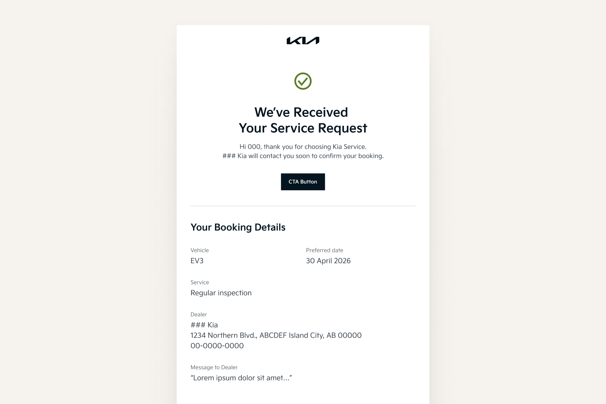

# Email Templates & Icon Assets

### Email Templates

We have developed the following email templates to address key customer communication needs.\
Each template is built with reusable components and can be flexibly adapted to local market requirements.

Included templates:

1. Service Booking Confirmation
2. Service Promotion
3. Vehicle Inspection Results

<a href="https://dcm.kia.com/product/contents/contentsForm.do?menuType=detail&#x26;categoryId=0b01e241800c7712&#x26;rObjectId=0901e2418022f395&#x26;pageType=D&#x26;rFolderId=0b01e241800c7712&#x26;hthumbnail=L&#x26;currPageNum=1&#x26;uProjectCode=&#x26;uMarket=&#x26;uDriveType=&#x26;uDoorType=&#x26;uContentType=&#x26;searchType=title&#x26;searchValue=" class="button primary">Download Email Templates (Figma)</a>

#### 1. Service Booking Confirmation

Confirms service appointments and provides customers with clear, timely booking details.

<figure><figcaption></figcaption></figure>

#### 2. Service Promotion

Promotes service offers and campaigns to encourage engagement and timely service visits.

<figure><figcaption></figcaption></figure>

#### 3. Vehicle Inspection Results

Communicates inspection outcomes and recommended actions in a clear and customer‑friendly format.

<figure><figcaption></figcaption></figure>

To ensure flexibility and consistency:

1. Keep the Hero section at the top and the Footer at the bottom. Other components can be freely arranged or removed based on content needs.
2. Adapt content, images, and links to suit local needs.
   &#x20;Ensure all information and links are valid in your market

### Icon Assets

Refer to the icons below for flexible use across different contexts. Select and apply icons based on your content and layout needs.

<a href="https://dcm.kia.com/product/contents/contentsForm.do?menuType=detail&#x26;categoryId=0b01e241800c7712&#x26;rObjectId=0901e2418022f396&#x26;pageType=D&#x26;rFolderId=0b01e241800c7712&#x26;hthumbnail=L&#x26;currPageNum=1&#x26;uProjectCode=&#x26;uMarket=&#x26;uDriveType=&#x26;uDoorType=&#x26;uContentType=&#x26;searchType=title&#x26;searchValue=" class="button primary">Download Icon Assets (SVG, PNG)</a>

<figure><figcaption>
Full Icon Set
</figcaption></figure>

<figure><figcaption>
UI Application
</figcaption></figure>

Follow these guidelines to ensure visibility and readability:

* **Minimum Size**\
  32px is the recommended minimum size. For 24px or below, use simplified icons.&#x20;
* **Clear Space**\
  Keep at least 10–15% of the icon size as clear space around the icon.
