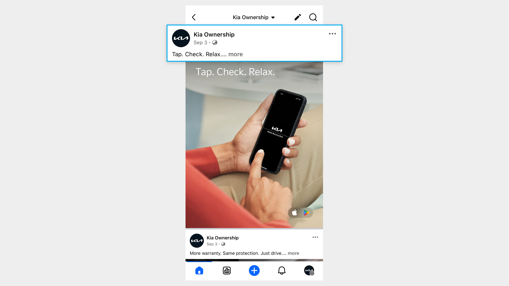

# Copy

As Facebook is based on user participation, develop copies that can encourage engagement, sharing and action-taking among its users.

#### Hook

* Short yet detailed copies before the ‘...more’ caption appears.\
  e.g., _Tap. Check. Relax.​_

<figure><figcaption></figcaption></figure>

#### Body

* Expressed in a bold, goal-oriented tone.
* Elaborate key benefits in detail to suggest what actions a user should take.\
  e.g., _Your Kia warranty and recall details, all in one handy app! Manage your vehicle smarter, right from your phone._

#### CTA

* Recommend inserting a clear, direct CTA copy in the last sentence.\
  e.g., _Download now \[Insert App Store / Country Link]_

#### Hashtag

* Recommend minimizing the use of hashtags (up to three).

