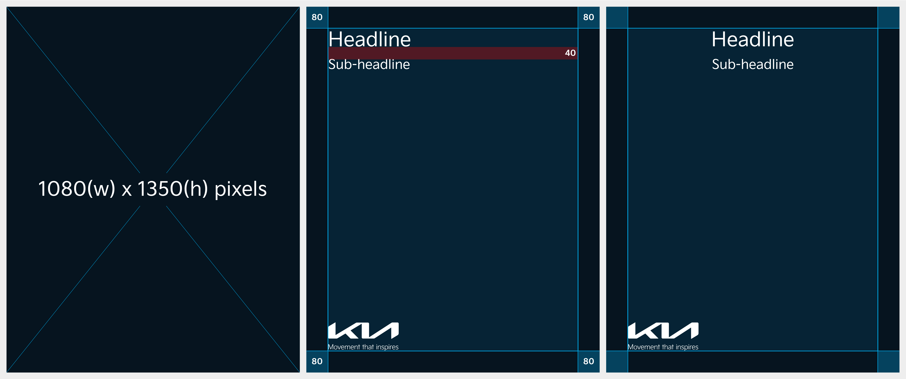

# Image

Facebook uses different aspect ratios depending on where the image or video is displayed.

### Aspect Ratio&#x20;

For best results, use the 4:5 portrait ratio (1080 x 1350 px) for feed posts, as it takes up more screen space and is supported across most sections.

* When posting multiple images, only the first image can have text and logo in it.
* As the aspect ratio varies depending on the number of images posted, make sure to refer to the following table.

| Number of images posted | Aspect Ratio of Displayed Image  |
| ----------------------- | -------------------------------- |
| 1 Image                 | 4:5                              |
| 2 Images                | 1:1                              |
| 3 Images                | 2:3                              |
| 4 Images                | First image: 2:3 / The rest: 1:1 |
| 5 Images                | 1:1                              |

<figure><figcaption></figcaption></figure>

***

### Layout

Ensure your content is designed with the safe zone in mind to prevent cropping, and follow the recommended aspect ratios for each platform.

#### Single Image

It is displayed in its original aspect ratio (4:5).

<figure><figcaption></figcaption></figure>

#### Two or Five Images

An original image (4:5) is displayed in a 1:1 aspect ratio.

<figure><figcaption></figcaption></figure>

#### Three or Four Images

An original image (4:5) is displayed in a 2:3 aspect ratio.

<figure><figcaption></figcaption></figure>


You can place text in all areas except for the margin and text is recommended to be left- or center-aligned.


***

### Typography

#### Headline

* Font: Kia Signature Regular&#x20;
* Size: 72pt&#x20;
* Line height: 94pt

#### Sub-headline

* Font: Kia Signature Regular&#x20;
* Size: 48pt&#x20;
* Line height: 62pt

#### Line Spacing

* Line Spacing: 40px

