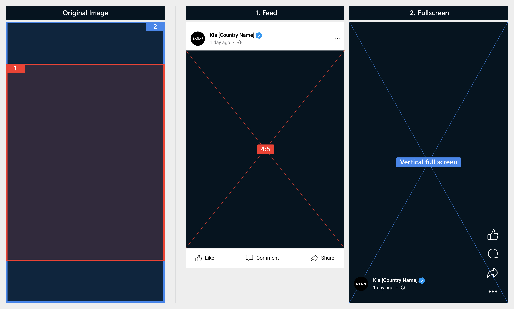
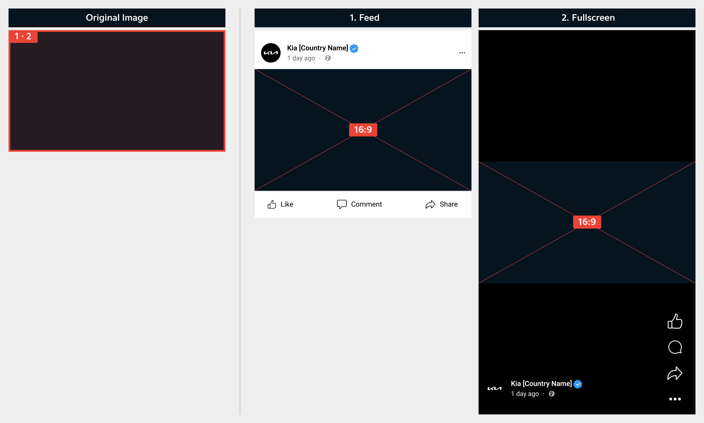
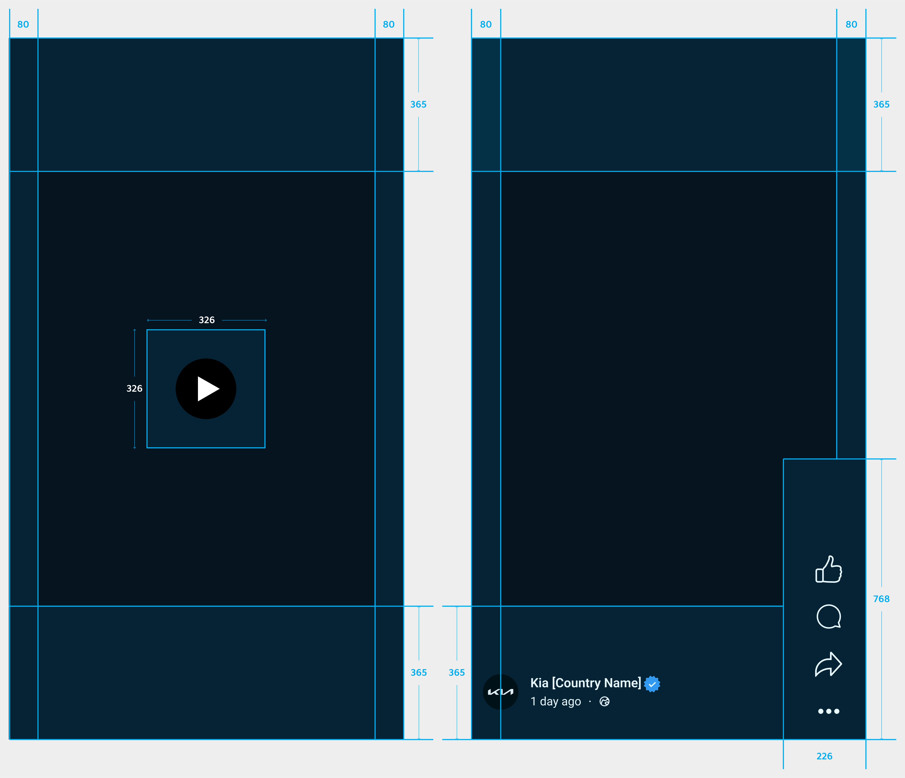
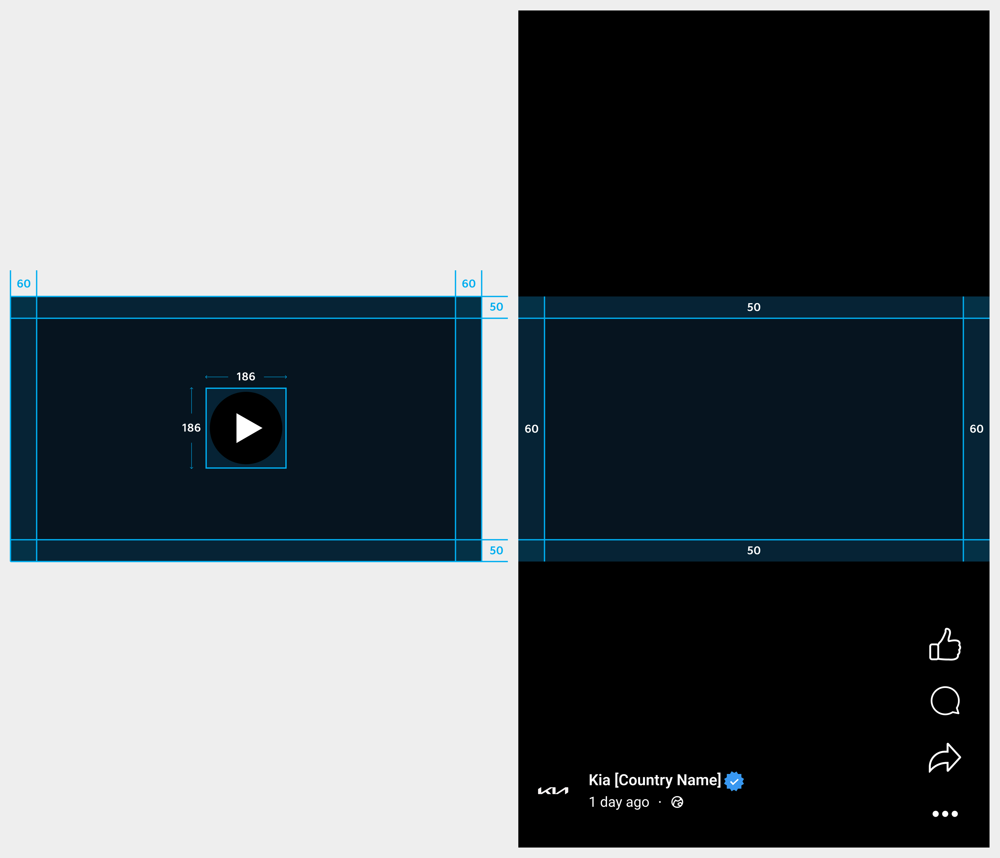
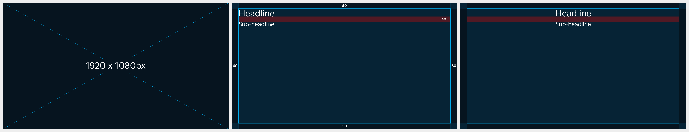

# Video Thumbnail

Since the aspect ratio of video thumbnails varies depending on the page, carefully consider which page you are creating content for.

### Aspect Ratio&#x20;

Given its mobile-oriented characteristics, we recommend using images sized 1920x1080 px in a 9:16 aspect ratio.\
However, 16:9 aspect ratio is recommended for landscape format content such as brand or campaign.

If you upload one thumbnail, it will be shown in the following aspect ratios in respective pages.

| Video Aspect Ratio | Location of Display | Aspect Ratio of Displayed Image |
| ------------------ | ------------------- | ------------------------------- |
| 9:16               | Feed                | 4:5                             |
| 9:16               | Full screen         | Vertical full screen            |
| 16:9               | Feed·Full screen    | 16:9                            |

#### 9:16 Video

<figure><figcaption></figcaption></figure>

#### 16:9 Video

<figure><figcaption></figcaption></figure>

***

### Safe Zone

Arrange key visuals and texts within the safe zone in consideration of the aspect ratios of each menu so that they do not get cropped.

#### 9:16 Video

<figure><figcaption></figcaption></figure>

#### 16:9 Video

<figure><figcaption></figcaption></figure>

***

### Layout

Uploaded images will be automatically shown in different aspect ratios according to each platform and exposure page. Make sure to produce content in consideration of the safe zone so as not to get cropped and follow the recommended aspect ratios for each platform.

#### 9:16 Video

An original image (9:16) is shown in a 4:5 ratio in the Feed.

<figure><figcaption></figcaption></figure>

#### 16:9 Video

It is shown in the same aspect ratio as that of the original image (16:9).

<figure><figcaption></figcaption></figure>


You can place text in all areas except for the margin and text is recommended to be left- or center-aligned.


***

### Typography

#### Headline

* Font: Kia Signature Regular&#x20;
* Size: 72pt&#x20;
* Line height: 94pt

#### Sub-headline

* Font: Kia Signature Regular&#x20;
* Size: 48pt&#x20;
* Line height: 62pt

#### Line Spacing

* Line Spacing: 40px

