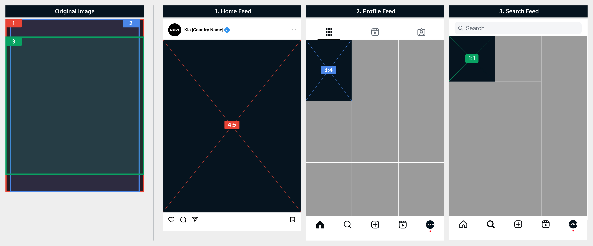
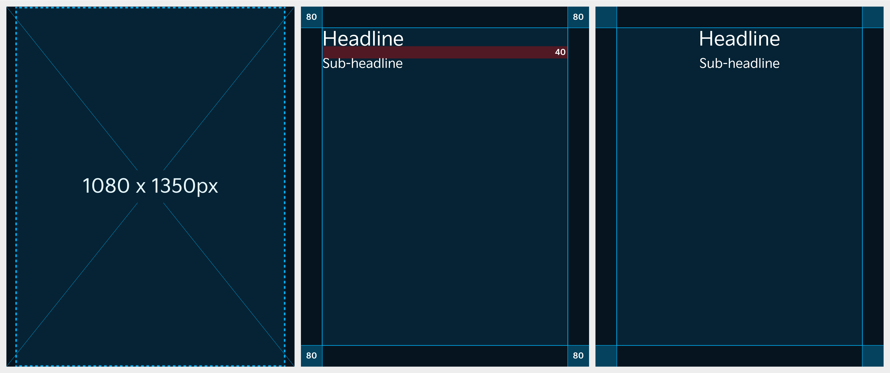

# Image

Instagram uses different aspect ratios depending on where the image or video is displayed.

### Aspect Ratio&#x20;

For best results, use the 4:5 portrait ratio (1080 x 1350 px) for feed posts, as it takes up more screen space and is supported across most sections.

| Location of Display | Aspect Ratio of Displayed Image |
| ------------------- | ------------------------------- |
| Home Feed           | 4:5                             |
| Profile Feed        | 3:4                             |
| Search Feed         | 1:1                             |

<figure><figcaption></figcaption></figure>

***

### Layout

Ensure your content is designed with the safe zone in mind to prevent cropping, and follow the recommended aspect ratios for each platform.

#### Default Display Aspect Ratios

An original image (4:5) is shown in the same aspect ratio in the Home feed while it is displayed in a 3:4 aspect ratio in the Profile feed.

<figure><figcaption></figcaption></figure>

#### In case you are considering exposure in Search feed

An original image (4:5) is exposed in a 1:1 aspect ratio in the Search feed.

<figure><figcaption></figcaption></figure>


You can place text in all areas except for the margin and text is recommended to be left- or center-aligned.


***

### Typography

#### Headline

* Font: Kia Signature Regular&#x20;
* Size: 72pt&#x20;
* Line height: 94pt

#### Sub-headline

* Font: Kia Signature Regular&#x20;
* Size: 48pt&#x20;
* Line height: 62pt

#### Line Spacing

* Line Spacing: 40px

