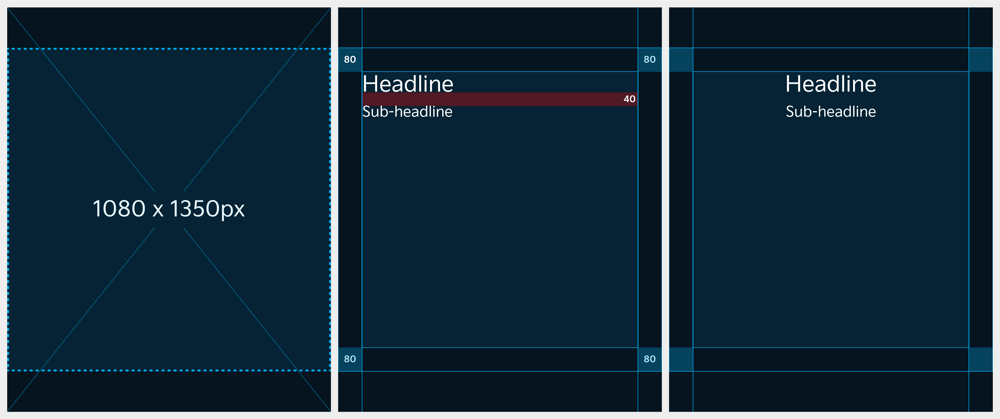

# Image

Since the aspect ratio of images varies depending on the menu, carefully consider which menu you are creating content for.

### Aspect Ratio&#x20;

Given its mobile-oriented characteristics, we recommend using images sized 1080x1350 px in a 4:5 aspect ratio.\
If you upload one image, it will be displayed in the following aspect ratios in respective menus.

| Location of Display | Aspect Ratio of Displayed Image |
| ------------------- | ------------------------------- |
| Home Feed           | 4:5                             |
| Profile Feed        | 3:4                             |
| Search Feed         | 1:1                             |

<figure><figcaption></figcaption></figure>

***

### Layout

Uploaded images will be automatically shown in different aspect ratios according to each platform and exposure page. Make sure to produce content in consideration of the safe zone so as not to get cropped and follow the recommended aspect ratios for each platform.

#### Default Display Aspect Ratios

An original image (4:5) is shown in the same aspect ratio in the Home feed while it is displayed in a 3:4 aspect ratio in the Profile feed.

<figure><figcaption></figcaption></figure>

#### In case you are considering exposure in Search feed

An original image (4:5) is exposed in a 1:1 aspect ratio in the Search feed.

<figure><figcaption></figcaption></figure>


You can place text in all areas except for the margin and text is recommended to be left- or center-aligned.


***

### Typography

#### Headline

* Font: Kia Signature Regular&#x20;
* Size: 72pt&#x20;
* Line height: 94pt

#### Sub-headline

* Font: Kia Signature Regular&#x20;
* Size: 48pt&#x20;
* Line height: 62pt

#### Line Spacing

* Line Spacing: 40px

