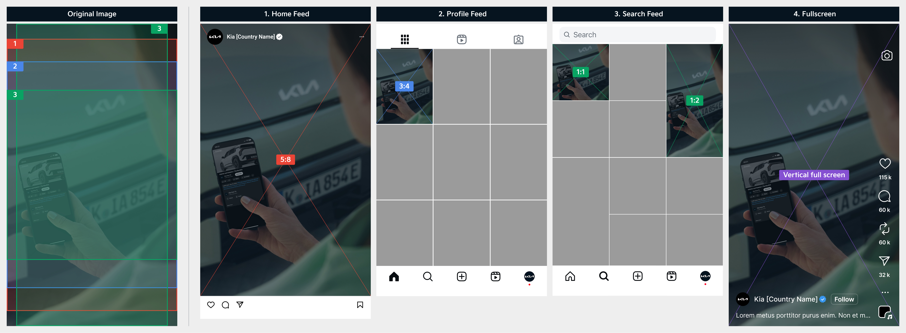
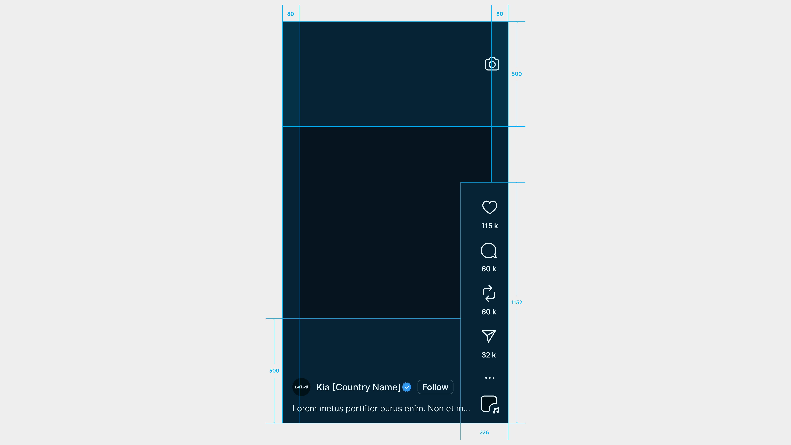
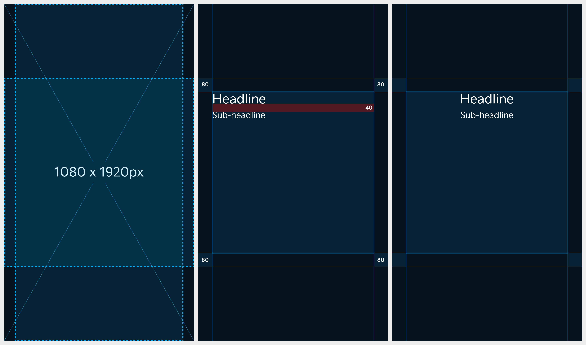

# Video Thumbnail

Instagram uses different aspect ratios depending on where the reel(video) is displayed.

### Aspect Ratio&#x20;

For best results, use the 9:16 ratio (1920 x 1080 px) for videos.\
Thumbnails will be shown in the following aspect ratios.

| Location of Display | Aspect Ratio of Displayed Image |
| ------------------- | ------------------------------- |
| Home Feed           | 5:8                             |
| Profile Feed        | 3:4                             |
| Search Feed         | 1:1, 1:2                        |
| Full Screen         | Vertical full screen            |

<figure><figcaption></figcaption></figure>

***

### Safe Zone

Arrange key visuals and text within the safe zone, taking into account the aspect ratios for each section, to prevent any cropping.

<figure><figcaption></figcaption></figure>

***

### Layout

Ensure your content is designed with the safe zone in mind to prevent cropping, and follow the recommended aspect ratios for each platform.

#### Default Display Aspect Ratios

An original image (9:16) is shown in a 5:8 ratio in the Home feed while it is displayed in a 3:4 aspect ratio in the Profile feed.

<figure><figcaption></figcaption></figure>

<figure><figcaption></figcaption></figure>

#### In case you are considering exposure in Search feed

An original image (9:16) is exposed in a 1:1 or 1:2 aspect ratio in the Profile feed.

<figure><figcaption></figcaption></figure>

<figure><figcaption></figcaption></figure>


You can place text in all areas except for the margin and text is recommended to be left- or center-aligned.


***

### Typography

#### Headline

* Font: Kia Signature Regular&#x20;
* Size: 72pt&#x20;
* Line height: 94pt

#### Sub-headline

* Font: Kia Signature Regular&#x20;
* Size: 48pt&#x20;
* Line height: 62pt

#### Line Spacing

* Line Spacing: 40px

