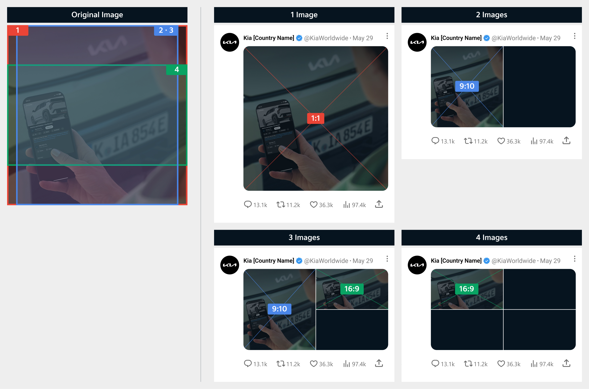

# Image

X uses different aspect ratios depending on where the image or video is displayed.

### Aspect Ratio

To minimize loss of image, we recommend using images sized 1080×1080 px in a 1:1 ratio.

* When posting multiple images, we recommend including text and logos only on the first image.
* As the aspect ratio varies depending on the number of images posted, make sure to refer to the following table.

| Number of images posted | Aspect Ratio of Displayed Image    |
| ----------------------- | ---------------------------------- |
| 1 Image                 | 1:1                                |
| 2 Images                | 9:10                               |
| 3 Images                | First image: 9:10 / The rest: 16:9 |
| 4 Images                | 16:9                               |

<figure><figcaption></figcaption></figure>

***

### Layout

Ensure your content is designed with the safe zone in mind to prevent cropping, and follow the recommended aspect ratios for each platform.

#### Single Image

It is displayed in its original aspect ratio (1:1).

<figure><figcaption></figcaption></figure>

<figure><figcaption></figcaption></figure>

#### **Two or Three Images**

An original image (1:1) is displayed in a 9:10 aspect ratio.

<figure><figcaption></figcaption></figure>

<figure><figcaption></figcaption></figure>

#### Four Images

An original image (1:1) is displayed in a 16:9 aspect ratio.

<figure><figcaption></figcaption></figure>

<figure><figcaption></figcaption></figure>


You can place text in all areas except for the margin and text is recommended to be left- or center-aligned.


***

### Typography

#### Headline

* Font: Kia Signature Regular&#x20;
* Size: 72pt&#x20;
* Line height: 94pt

#### Sub-headline

* Font: Kia Signature Regular&#x20;
* Size: 48pt&#x20;
* Line height: 62pt

#### Line Spacing

* Line Spacing: 40px

