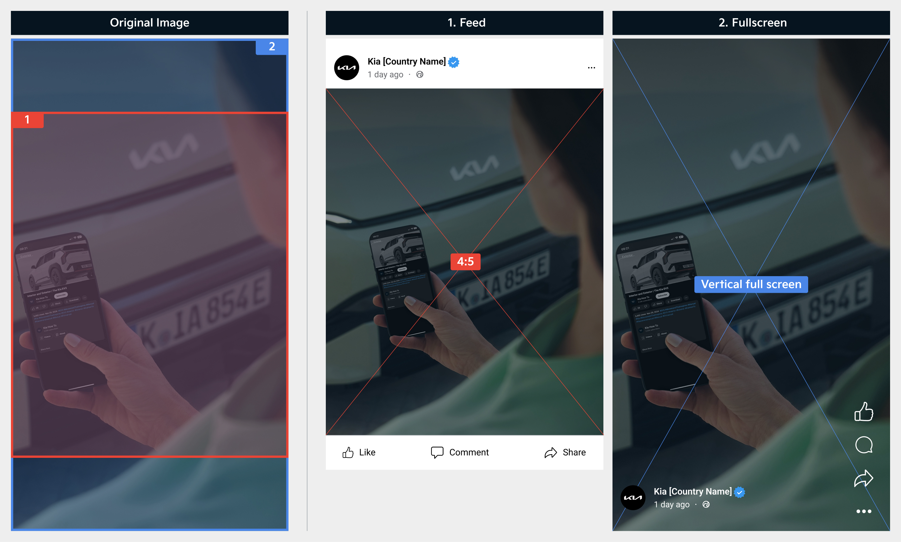
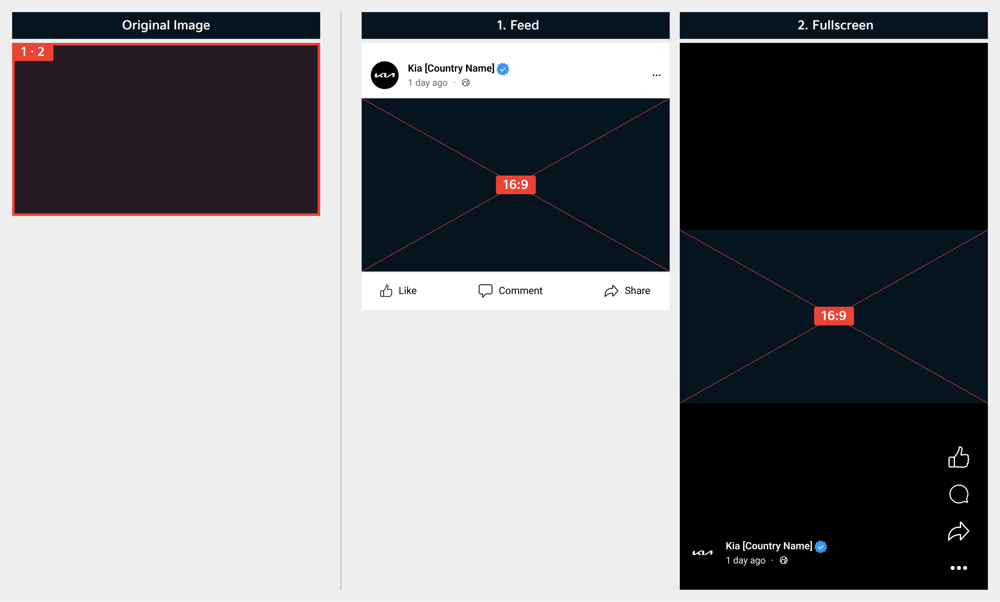
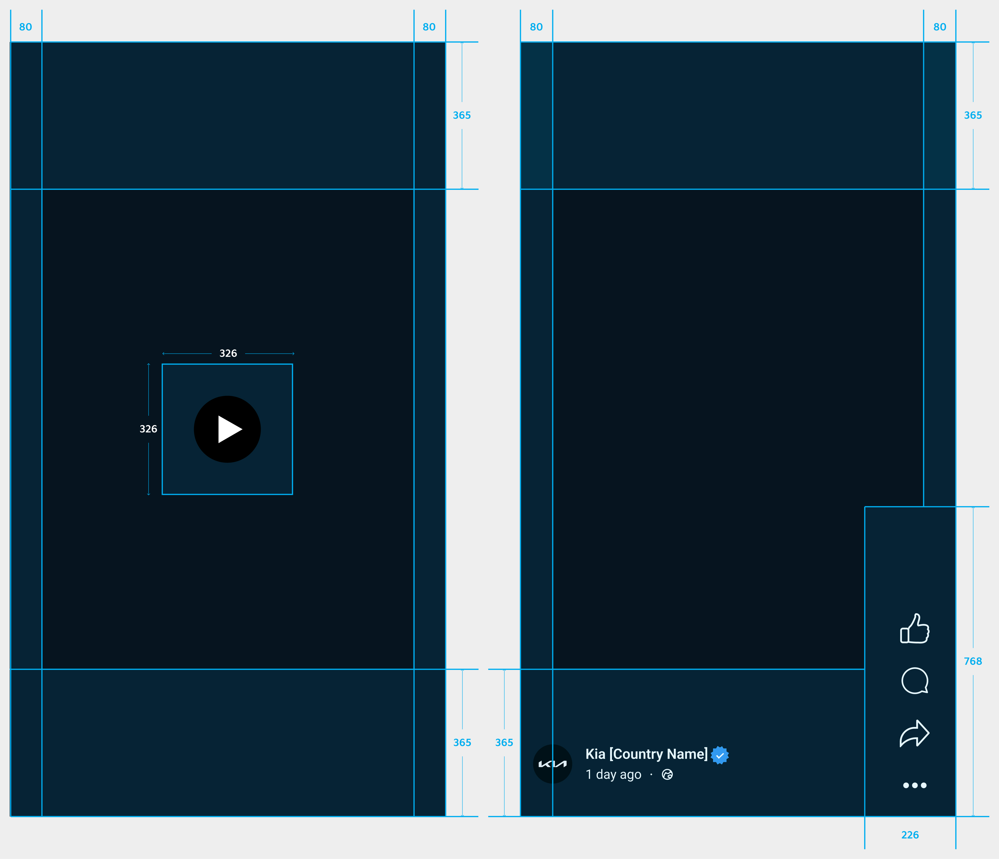
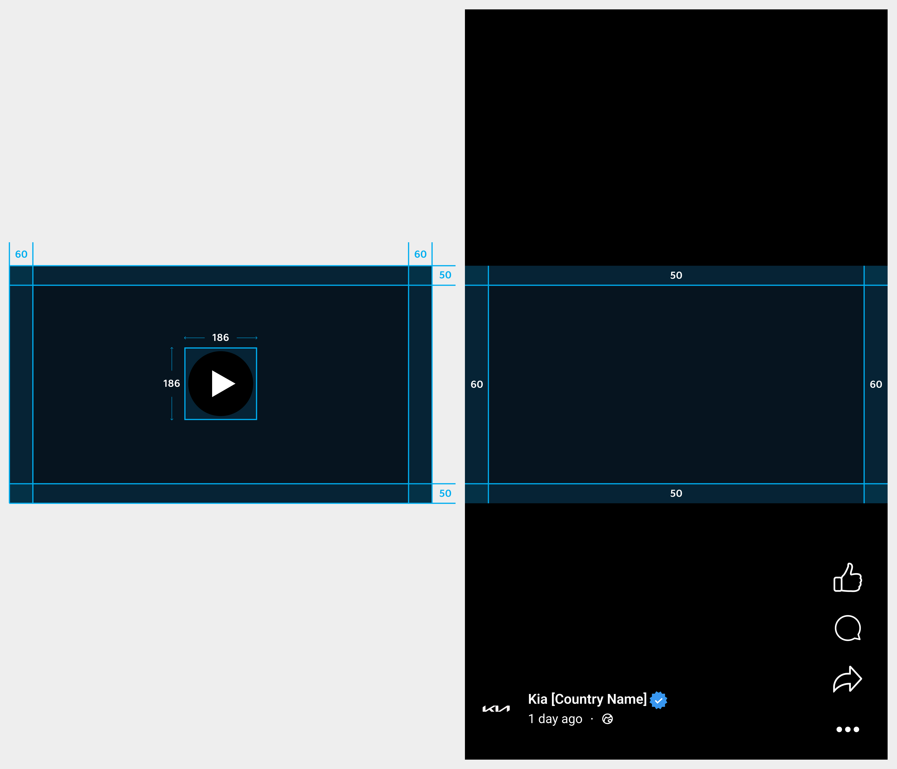
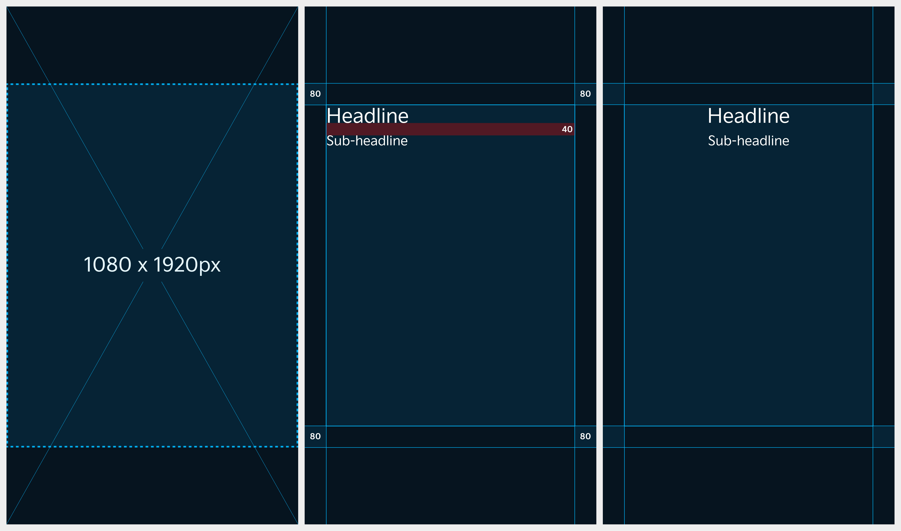
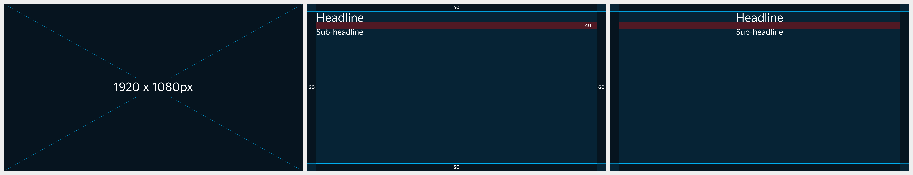

# Video Thumbnail

화면별 노출되는 동영상 썸네일 비율이 다르므로, 콘텐츠 제작 시 반드시 고려해야 합니다.

### Aspect Ratio&#x20;

모바일 중심 플랫폼 특성을 고려하여 9:16 비율의 1920 × 1080px 썸네일 사용을 권장합니다.\
단, 브랜드·캠페인 등 가로 제작 중심 콘텐츠는 16:9 썸네일 사용을 권장합니다.

1개의 썸네일을 업로드할 경우, 각 화면에서 아래와 같은 비율로 노출됩니다.

| 동영상 비율 | 노출 위치   | 노출 비율                |
| ------ | ------- | -------------------- |
| 9:16   | 피드      | 4:5                  |
| 9:16   | 풀스크린    | Vertical full screen |
| 16:9   | 피드·풀스크린 | 16:9                 |

#### 9:16 동영상

<figure><figcaption></figcaption></figure>

#### 16:9 동영상

<figure><figcaption></figcaption></figure>

***

### Safe Zone

메뉴별 노출 비율을 고려하여 핵심 비주얼과 텍스트가 잘리지 않도록 세이프존 안에 배치해야 합니다.

#### 9:16 동영상

<figure><figcaption></figcaption></figure>

#### 16:9 동영상

<figure><figcaption></figcaption></figure>

***

### 구성

업로드한 이미지는 채널과 노출 위치에 따라 자동으로 다른 비율로 표시됩니다. 주요 요소가 잘리지 않도록 안전 영역을 확보하고, 각 채널별 권장 비율을 준수해 주세요.

#### 9:16 동영상

원본 이미지(9:16)가 피드에서는 4:5 비율로 노출됩니다.

<figure><figcaption></figcaption></figure>

#### 16:9 동영상

원본 이미지 비율(16:9) 그대로 노출됩니다.

<figure><figcaption></figcaption></figure>

***

### Typography

#### Headline

* Font: Kia Signature Regular&#x20;
* Size: 72pt&#x20;
* Line height: 94pt

#### Sub-headline

* Font: Kia Signature Regular&#x20;
* Size: 48pt&#x20;
* Line height: 62pt

#### Line Spacing

* Line Spacing: 40px

