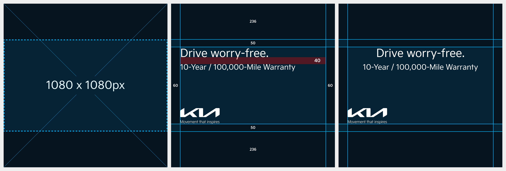

# Image

등록 이미지 개수에 따라 노출 비율이 달라지므로 콘텐츠 제작 시 반드시 고려해야 합니다.

### Aspect Ratio

이미지 손실을 최소화하기 위해 1:1 비율의 1080 × 1080px 이미지 사용을 권장합니다.

* Multi Image 등록 시, 첫 번째 이미지에만 텍스트 및 로고 삽입 가능합니다.
* 등록 이미지 개수에 따라 노출 비율이 달라지므로 반드시 아래 기준을 고려해야 합니다.

| 등록 이미지 개수 | 노출 비율                  |
| --------- | ---------------------- |
| 1개        | 1:1                    |
| 2개        | 9:10                   |
| 3개        | 첫 번째: 9:10 / 나머지: 16:9 |
| 4개        | 16:9                   |

<figure><figcaption></figcaption></figure>

***

### 구성

업로드한 이미지는 채널과 노출 위치에 따라 자동으로 다른 비율로 표시됩니다. 주요 요소가 잘리지 않도록 안전 영역을 확보하고, 각 채널별 권장 비율을 준수해 주세요.

#### 단일 이미지 등록

원본 이미지 비율(1:1) 그대로 노출됩니다.

<figure><figcaption></figcaption></figure>

#### 2개 또는 3개 이미지 등록

원본 이미지(1:1)가 9:10 비율로 노출됩니다.

<figure><figcaption></figcaption></figure>

#### 4개 이미지 등록

원본 이미지(1:1)가 16:9 비율로 노출됩니다.

<figure><figcaption></figcaption></figure>

***

### Typography

#### Headline

* Font: Kia Signature Regular&#x20;
* Size: 72pt&#x20;
* Line height: 94pt

#### Sub-headline

* Font: Kia Signature Regular&#x20;
* Size: 48pt&#x20;
* Line height: 62pt

#### Line Spacing

* Line Spacing: 40px

