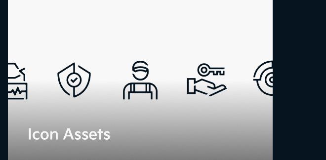
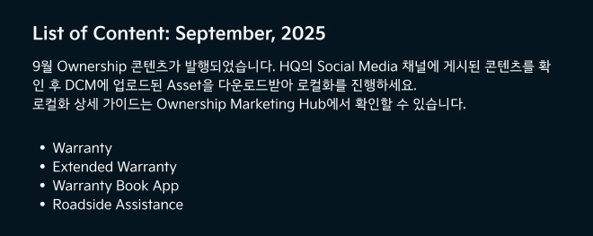
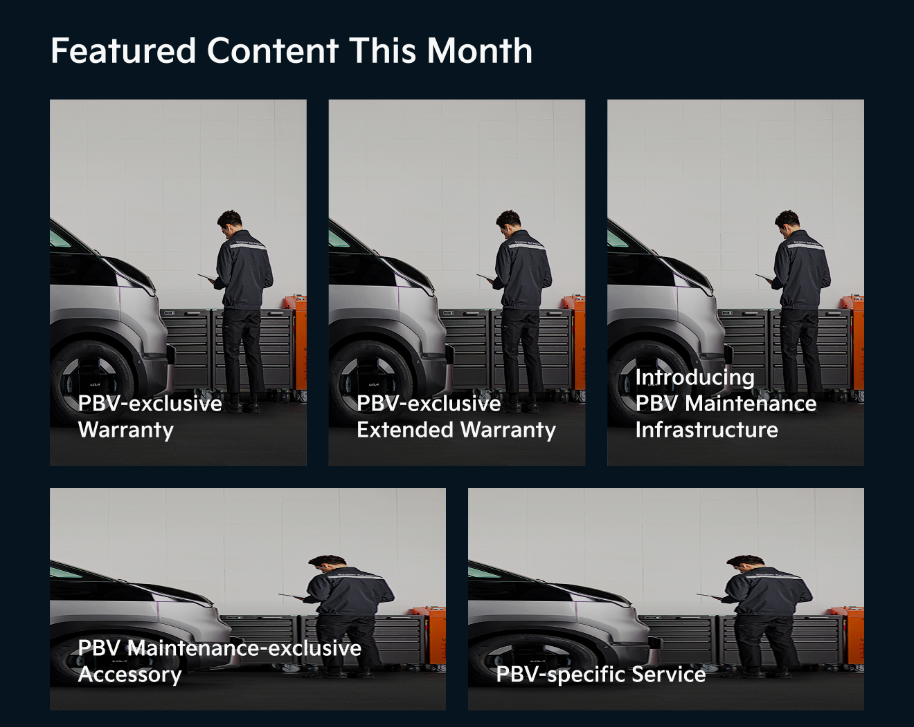
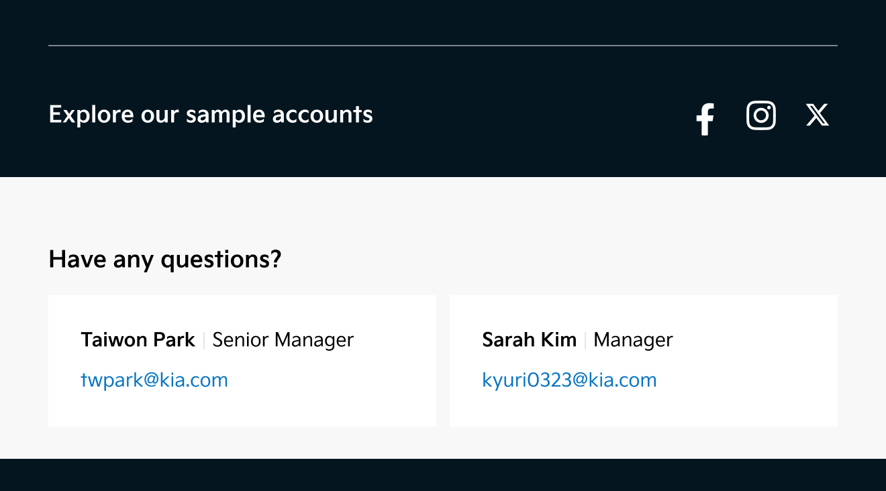
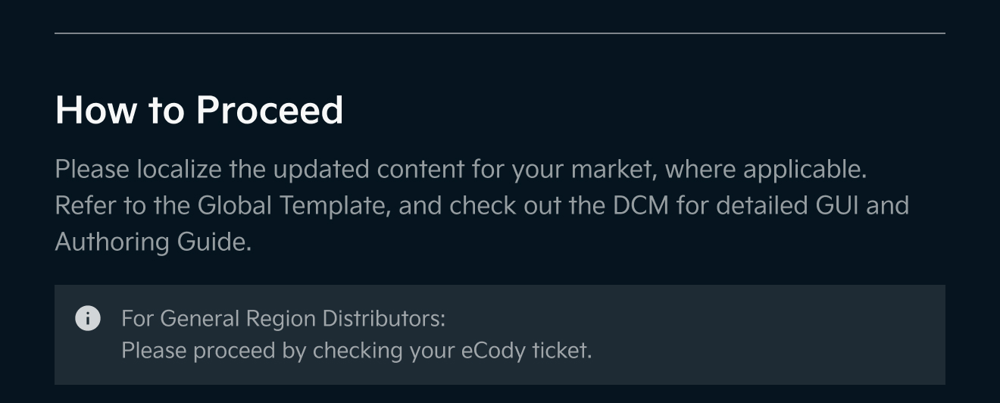
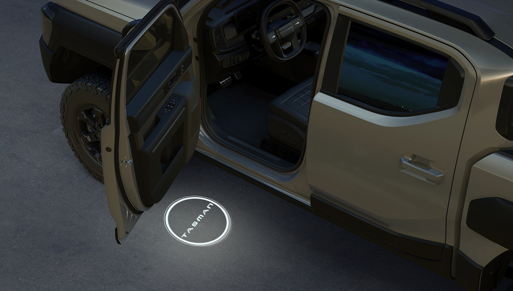
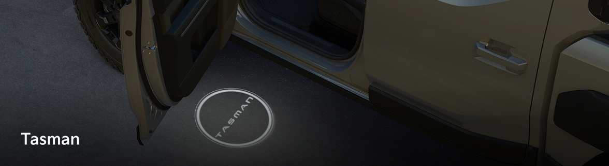
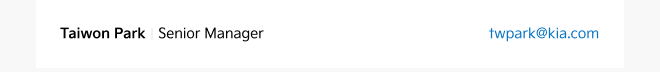
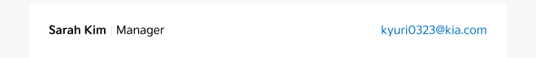

# Newsletter img

## 5개 버전

#### 01

<figure><figcaption></figcaption></figure>

URL

[https://images.gitbook.com/\_\_img/dpr=2,width=760,onerror=redirect,format=auto,signature=-529945742/https%3A%2F%2Ffiles.gitbook.com%2Fv0%2Fb%2Fgitbook-x-prod.appspot.com%2Fo%2Fspaces%252Fw5lfZjNS4U8oixK11ksH%252Fuploads%252FhnraL9KMh8fjfApYxG26%252F01-logo.jpg%3Falt%3Dmedia%26token%3Dc7e5a9ee-258e-4be8-b754-caff72e160e7](https://images.gitbook.com/__img/dpr=2,width=760,onerror=redirect,format=auto,signature=-529945742/https%3A%2F%2Ffiles.gitbook.com%2Fv0%2Fb%2Fgitbook-x-prod.appspot.com%2Fo%2Fspaces%2Fw5lfZjNS4U8oixK11ksH%2Fuploads%2FhnraL9KMh8fjfApYxG26%2F01-logo.jpg%3Falt%3Dmedia%26token%3Dc7e5a9ee-258e-4be8-b754-caff72e160e7)

#### 02

<figure><figcaption></figcaption></figure>

03

<figure><figcaption></figcaption></figure>

04

<figure><figcaption></figcaption></figure> <figure><figcaption></figcaption></figure> <figure><figcaption></figcaption></figure>

05

<figure><figcaption></figcaption></figure>

06

<figure><figcaption></figcaption></figure> <figure><figcaption></figcaption></figure> <figure><figcaption></figcaption></figure> <figure><figcaption></figcaption></figure> <figure><figcaption></figcaption></figure> <figure><figcaption></figcaption></figure> <figure><figcaption></figcaption></figure>

07

<figure><figcaption></figcaption></figure>

08

<figure><figcaption></figcaption></figure> <figure><figcaption></figcaption></figure> <figure><figcaption></figcaption></figure> <figure><figcaption></figcaption></figure> <figure><figcaption></figcaption></figure>

09

<figure><figcaption></figcaption></figure>

10

<figure><figcaption></figcaption></figure> <figure><figcaption></figcaption></figure> <figure><figcaption></figcaption></figure> <figure><figcaption></figcaption></figure> <figure><figcaption></figcaption></figure> <figure><figcaption></figcaption></figure>

11

<figure><figcaption></figcaption></figure>

12

<figure><figcaption></figcaption></figure>

13

<figure><figcaption></figcaption></figure> <figure><figcaption></figcaption></figure> <figure><figcaption></figcaption></figure> <figure><figcaption></figcaption></figure> <figure><figcaption></figcaption></figure>

14

<figure><figcaption></figcaption></figure>

<figure><figcaption></figcaption></figure> <figure><figcaption></figcaption></figure> <figure><figcaption></figcaption></figure> <figure><figcaption></figcaption></figure> <figure><figcaption></figcaption></figure>

***

## 1개 버전

06

<figure><figcaption></figcaption></figure> <figure><figcaption></figcaption></figure> <figure><figcaption></figcaption></figure>

***

## 10월 발행

<figure><figcaption></figcaption></figure> <figure><figcaption></figcaption></figure> <figure><figcaption></figcaption></figure> <figure><figcaption></figcaption></figure>

## 9월 발행

<figure><figcaption></figcaption></figure> <figure><figcaption></figcaption></figure> <figure><figcaption></figcaption></figure> <figure><figcaption></figcaption></figure>

## Test

<figure><figcaption></figcaption></figure> <figure><figcaption></figcaption></figure> <figure><figcaption></figcaption></figure> <figure><figcaption></figcaption></figure> <figure><figcaption></figcaption></figure> <figure><figcaption></figcaption></figure> <figure><figcaption></figcaption></figure>

## Test - Img조각(2배)

<figure><figcaption></figcaption></figure> <figure><figcaption></figcaption></figure> <figure><figcaption></figcaption></figure> <figure><figcaption></figcaption></figure> <figure><figcaption></figcaption></figure> <figure><figcaption></figcaption></figure> <figure><figcaption></figcaption></figure> <figure><figcaption></figcaption></figure> <figure><figcaption></figcaption></figure> <figure><figcaption></figcaption></figure> <figure><figcaption></figcaption></figure> <figure><figcaption></figcaption></figure> <figure><figcaption></figcaption></figure> <figure><figcaption></figcaption></figure> <figure><figcaption></figcaption></figure> <figure><figcaption></figcaption></figure> <figure><figcaption></figcaption></figure> <figure><figcaption></figcaption></figure> <figure><figcaption></figcaption></figure> <figure><figcaption></figcaption></figure> <figure><figcaption></figcaption></figure> <figure><figcaption></figcaption></figure> <figure><figcaption></figcaption></figure>

v.2 11번 구분

<figure><figcaption></figcaption></figure> <figure><figcaption></figcaption></figure>

## Newsletter Test - 다크모드 (660px @2배수 추출)&#x20;

#### 01-공통 리소스: 로고

<figure><figcaption></figcaption></figure>

이미지 URL

[https://images.gitbook.com/\_\_img/dpr=2,width=2400,onerror=redirect,format=auto,signature=1340640983/https%3A%2F%2Ffiles.gitbook.com%2Fv0%2Fb%2Fgitbook-x-prod.appspot.com%2Fo%2Fspaces%252Fw5lfZjNS4U8oixK11ksH%252Fuploads%252Fgp7S72dr385pIGmStIEy%252F01-logo-660x105.jpg%3Falt%3Dmedia%26token%3D6013dff8-0b34-449a-b91e-788e430902cc](https://images.gitbook.com/__img/dpr=2,width=2400,onerror=redirect,format=auto,signature=1340640983/https%3A%2F%2Ffiles.gitbook.com%2Fv0%2Fb%2Fgitbook-x-prod.appspot.com%2Fo%2Fspaces%2Fw5lfZjNS4U8oixK11ksH%2Fuploads%2Fgp7S72dr385pIGmStIEy%2F01-logo-660x105.jpg%3Falt%3Dmedia%26token%3D6013dff8-0b34-449a-b91e-788e430902cc)

#### 02-KV 이미지&#x20;

11월 URL

<figure><figcaption></figcaption></figure>

* URL&#x20;
  * [https://images.gitbook.com/\_\_img/dpr=2,width=2400,onerror=redirect,format=auto,signature=-673304902/https%3A%2F%2Ffiles.gitbook.com%2Fv0%2Fb%2Fgitbook-x-prod.appspot.com%2Fo%2Fspaces%252Fw5lfZjNS4U8oixK11ksH%252Fuploads%252FX4TfSGBdoriq16qUemqd%252F02-img-tasman.jpg%3Falt%3Dmedia%26token%3D62a57603-d27b-4ef8-bc88-b1e68f97258f](https://images.gitbook.com/__img/dpr=2,width=2400,onerror=redirect,format=auto,signature=-673304902/https%3A%2F%2Ffiles.gitbook.com%2Fv0%2Fb%2Fgitbook-x-prod.appspot.com%2Fo%2Fspaces%2Fw5lfZjNS4U8oixK11ksH%2Fuploads%2FX4TfSGBdoriq16qUemqd%2F02-img-tasman.jpg%3Falt%3Dmedia%26token%3D62a57603-d27b-4ef8-bc88-b1e68f97258f)

#### 03- 본문 텍스트

11월 URL

<figure><figcaption></figcaption></figure>

[https://images.gitbook.com/\_\_img/dpr=2,width=2400,onerror=redirect,format=auto,signature=2044303265/https%3A%2F%2Ffiles.gitbook.com%2Fv0%2Fb%2Fgitbook-x-prod.appspot.com%2Fo%2Fspaces%252Fw5lfZjNS4U8oixK11ksH%252Fuploads%252FuYcthRrRbPF1uTDgVjIT%252F03-11%2520text-660x256.jpg%3Falt%3Dmedia%26token%3Dbb0004ef-5cab-480e-89eb-85795b4119ca](https://images.gitbook.com/__img/dpr=2,width=2400,onerror=redirect,format=auto,signature=2044303265/https%3A%2F%2Ffiles.gitbook.com%2Fv0%2Fb%2Fgitbook-x-prod.appspot.com%2Fo%2Fspaces%2Fw5lfZjNS4U8oixK11ksH%2Fuploads%2FuYcthRrRbPF1uTDgVjIT%2F03-11%20text-660x256.jpg%3Falt%3Dmedia%26token%3Dbb0004ef-5cab-480e-89eb-85795b4119ca)

#### 04-공통 리소스: Ownership Marketing Hub 버튼

<figure><figcaption></figcaption></figure> <figure><figcaption></figcaption></figure> <figure><figcaption></figcaption></figure>

URL (좌측부터)

* 01\. 좌측 여백 36x40
  * [https://images.gitbook.com/\_\_img/dpr=2,width=2400,onerror=redirect,format=auto,signature=-403456806/https%3A%2F%2Ffiles.gitbook.com%2Fv0%2Fb%2Fgitbook-x-prod.appspot.com%2Fo%2Fspaces%252Fw5lfZjNS4U8oixK11ksH%252Fuploads%252FlwktUCeAvN0Skc1NfgkK%252F04-1.jpg%3Falt%3Dmedia%26token%3D21e12c13-d0ac-4bac-9fa3-e10c57319460](https://images.gitbook.com/__img/dpr=2,width=2400,onerror=redirect,format=auto,signature=-403456806/https%3A%2F%2Ffiles.gitbook.com%2Fv0%2Fb%2Fgitbook-x-prod.appspot.com%2Fo%2Fspaces%2Fw5lfZjNS4U8oixK11ksH%2Fuploads%2FlwktUCeAvN0Skc1NfgkK%2F04-1.jpg%3Falt%3Dmedia%26token%3D21e12c13-d0ac-4bac-9fa3-e10c57319460)
* 02\. 버튼 212x40
  * [https://images.gitbook.com/\_\_img/dpr=2,width=2400,onerror=redirect,format=auto,signature=-1922636328/https%3A%2F%2Ffiles.gitbook.com%2Fv0%2Fb%2Fgitbook-x-prod.appspot.com%2Fo%2Fspaces%252Fw5lfZjNS4U8oixK11ksH%252Fuploads%252FIq9LvBaaCY0e0GQR7WE1%252F04-2-button.jpg%3Falt%3Dmedia%26token%3D69ce491e-728b-4415-9b5e-aab8bda3a2e0](https://images.gitbook.com/__img/dpr=2,width=2400,onerror=redirect,format=auto,signature=-1922636328/https%3A%2F%2Ffiles.gitbook.com%2Fv0%2Fb%2Fgitbook-x-prod.appspot.com%2Fo%2Fspaces%2Fw5lfZjNS4U8oixK11ksH%2Fuploads%2FIq9LvBaaCY0e0GQR7WE1%2F04-2-button.jpg%3Falt%3Dmedia%26token%3D69ce491e-728b-4415-9b5e-aab8bda3a2e0)
* 03 우측 여백 412x40
  * [https://images.gitbook.com/\_\_img/dpr=2,width=2400,onerror=redirect,format=auto,signature=79667709/https%3A%2F%2Ffiles.gitbook.com%2Fv0%2Fb%2Fgitbook-x-prod.appspot.com%2Fo%2Fspaces%252Fw5lfZjNS4U8oixK11ksH%252Fuploads%252F3ryvTqHV4ATKSQ4ThIN4%252F04-3.jpg%3Falt%3Dmedia%26token%3De24c0453-4f31-443d-bf12-215184144cb2](https://images.gitbook.com/__img/dpr=2,width=2400,onerror=redirect,format=auto,signature=79667709/https%3A%2F%2Ffiles.gitbook.com%2Fv0%2Fb%2Fgitbook-x-prod.appspot.com%2Fo%2Fspaces%2Fw5lfZjNS4U8oixK11ksH%2Fuploads%2F3ryvTqHV4ATKSQ4ThIN4%2F04-3.jpg%3Falt%3Dmedia%26token%3De24c0453-4f31-443d-bf12-215184144cb2)

#### 05-공통 리소스: Featured Content This Month

URL

<figure><figcaption></figcaption></figure>

[https://images.gitbook.com/\_\_img/dpr=2,width=2400,onerror=redirect,format=auto,signature=-513895100/https%3A%2F%2Ffiles.gitbook.com%2Fv0%2Fb%2Fgitbook-x-prod.appspot.com%2Fo%2Fspaces%252Fw5lfZjNS4U8oixK11ksH%252Fuploads%252FxCK6enRKEr8udfNBulCI%252F05-title.jpg%3Falt%3Dmedia%26token%3Dd59f9d08-5d8f-4d7a-ba4d-682de18b8fa7](https://images.gitbook.com/__img/dpr=2,width=2400,onerror=redirect,format=auto,signature=-513895100/https%3A%2F%2Ffiles.gitbook.com%2Fv0%2Fb%2Fgitbook-x-prod.appspot.com%2Fo%2Fspaces%2Fw5lfZjNS4U8oixK11ksH%2Fuploads%2FxCK6enRKEr8udfNBulCI%2F05-title.jpg%3Falt%3Dmedia%26token%3Dd59f9d08-5d8f-4d7a-ba4d-682de18b8fa7)

#### 06-카드 1단

<figure><figcaption></figcaption></figure> <figure><figcaption></figcaption></figure>

좌, 우측 여백 36x161&#x20;

[https://images.gitbook.com/\_\_img/dpr=2,width=2400,onerror=redirect,format=auto,signature=-78325955/https%3A%2F%2Ffiles.gitbook.com%2Fv0%2Fb%2Fgitbook-x-prod.appspot.com%2Fo%2Fspaces%252Fw5lfZjNS4U8oixK11ksH%252Fuploads%252Fxc7BAKo048Fo0TNlifek%252F06-1-36x161.jpg%3Falt%3Dmedia%26token%3Da900236d-dabf-497f-ab31-86b03696e12e](https://images.gitbook.com/__img/dpr=2,width=2400,onerror=redirect,format=auto,signature=-78325955/https%3A%2F%2Ffiles.gitbook.com%2Fv0%2Fb%2Fgitbook-x-prod.appspot.com%2Fo%2Fspaces%2Fw5lfZjNS4U8oixK11ksH%2Fuploads%2Fxc7BAKo048Fo0TNlifek%2F06-1-36x161.jpg%3Falt%3Dmedia%26token%3Da900236d-dabf-497f-ab31-86b03696e12e)

Image 558x161

[https://images.gitbook.com/\_\_img/dpr=2,width=2400,onerror=redirect,format=auto,signature=1366381647/https%3A%2F%2Ffiles.gitbook.com%2Fv0%2Fb%2Fgitbook-x-prod.appspot.com%2Fo%2Fspaces%252Fw5lfZjNS4U8oixK11ksH%252Fuploads%252FsSWigj9sPKIWoi3YnYTJ%252F06-2-558x161.jpg%3Falt%3Dmedia%26token%3Ddf46a7ef-4730-42b1-8cc5-4bacbbe169e3](https://images.gitbook.com/__img/dpr=2,width=2400,onerror=redirect,format=auto,signature=1366381647/https%3A%2F%2Ffiles.gitbook.com%2Fv0%2Fb%2Fgitbook-x-prod.appspot.com%2Fo%2Fspaces%2Fw5lfZjNS4U8oixK11ksH%2Fuploads%2FsSWigj9sPKIWoi3YnYTJ%2F06-2-558x161.jpg%3Falt%3Dmedia%26token%3Ddf46a7ef-4730-42b1-8cc5-4bacbbe169e3)

#### 06-카드 3단

<figure><figcaption></figcaption></figure> <figure><figcaption></figcaption></figure> <figure><figcaption></figcaption></figure> <figure><figcaption></figcaption></figure> <figure><figcaption></figcaption></figure> <figure><figcaption></figcaption></figure>

<strong>공통 여백 URL (좌측부터)</strong>

* 36px 마진값 좌, 우측 동일
  * [https://images.gitbook.com/\_\_img/dpr=2,width=2400,onerror=redirect,format=auto,signature=-2107407931/https%3A%2F%2Ffiles.gitbook.com%2Fv0%2Fb%2Fgitbook-x-prod.appspot.com%2Fo%2Fspaces%252Fw5lfZjNS4U8oixK11ksH%252Fuploads%252F8duxiYCdwp7UKYZHudaH%252F06-1.jpg%3Falt%3Dmedia%26token%3D190e2b8c-3983-440a-8388-c189ac990fdb](https://images.gitbook.com/__img/dpr=2,width=2400,onerror=redirect,format=auto,signature=-2107407931/https%3A%2F%2Ffiles.gitbook.com%2Fv0%2Fb%2Fgitbook-x-prod.appspot.com%2Fo%2Fspaces%2Fw5lfZjNS4U8oixK11ksH%2Fuploads%2F8duxiYCdwp7UKYZHudaH%2F06-1.jpg%3Falt%3Dmedia%26token%3D190e2b8c-3983-440a-8388-c189ac990fdb)
* 16px 마진값 (1번, 2번 카드 사이)
  * [https://images.gitbook.com/\_\_img/dpr=2,width=2400,onerror=redirect,format=auto,signature=-1698284062/https%3A%2F%2Ffiles.gitbook.com%2Fv0%2Fb%2Fgitbook-x-prod.appspot.com%2Fo%2Fspaces%252Fw5lfZjNS4U8oixK11ksH%252Fuploads%252Fafx4P3aUxSHckGw2puCm%252F06-3.jpg%3Falt%3Dmedia%26token%3D8eac93a3-0c0c-415c-87cc-2514bb9bf0e7](https://images.gitbook.com/__img/dpr=2,width=2400,onerror=redirect,format=auto,signature=-1698284062/https%3A%2F%2Ffiles.gitbook.com%2Fv0%2Fb%2Fgitbook-x-prod.appspot.com%2Fo%2Fspaces%2Fw5lfZjNS4U8oixK11ksH%2Fuploads%2Fafx4P3aUxSHckGw2puCm%2F06-3.jpg%3Falt%3Dmedia%26token%3D8eac93a3-0c0c-415c-87cc-2514bb9bf0e7)
* 17px 마진값 (2번, 3번 카드 사이)
  * [https://images.gitbook.com/\_\_img/dpr=2,width=2400,onerror=redirect,format=auto,signature=2071834983/https%3A%2F%2Ffiles.gitbook.com%2Fv0%2Fb%2Fgitbook-x-prod.appspot.com%2Fo%2Fspaces%252Fw5lfZjNS4U8oixK11ksH%252Fuploads%252FT2PO0u5gP6QauUom1Bht%252F06-5.jpg%3Falt%3Dmedia%26token%3D7e5092f5-96d7-4107-a094-ef2938dd256c](https://images.gitbook.com/__img/dpr=2,width=2400,onerror=redirect,format=auto,signature=2071834983/https%3A%2F%2Ffiles.gitbook.com%2Fv0%2Fb%2Fgitbook-x-prod.appspot.com%2Fo%2Fspaces%2Fw5lfZjNS4U8oixK11ksH%2Fuploads%2FT2PO0u5gP6QauUom1Bht%2F06-5.jpg%3Falt%3Dmedia%26token%3D7e5092f5-96d7-4107-a094-ef2938dd256c)

Test 카드 3장 URL (좌측부터) 185x265

* [https://images.gitbook.com/\_\_img/dpr=2,width=2400,onerror=redirect,format=auto,signature=1242208388/https%3A%2F%2Ffiles.gitbook.com%2Fv0%2Fb%2Fgitbook-x-prod.appspot.com%2Fo%2Fspaces%252Fw5lfZjNS4U8oixK11ksH%252Fuploads%252FFfDrLJ1NQwrZP0z3G9Uz%252F06-2-card.jpg%3Falt%3Dmedia%26token%3Dee7c0833-d8b5-4b45-b3ca-54305df42579](https://images.gitbook.com/__img/dpr=2,width=2400,onerror=redirect,format=auto,signature=1242208388/https%3A%2F%2Ffiles.gitbook.com%2Fv0%2Fb%2Fgitbook-x-prod.appspot.com%2Fo%2Fspaces%2Fw5lfZjNS4U8oixK11ksH%2Fuploads%2FFfDrLJ1NQwrZP0z3G9Uz%2F06-2-card.jpg%3Falt%3Dmedia%26token%3Dee7c0833-d8b5-4b45-b3ca-54305df42579)
* [https://images.gitbook.com/\_\_img/dpr=2,width=2400,onerror=redirect,format=auto,signature=2001299618/https%3A%2F%2Ffiles.gitbook.com%2Fv0%2Fb%2Fgitbook-x-prod.appspot.com%2Fo%2Fspaces%252Fw5lfZjNS4U8oixK11ksH%252Fuploads%252FcSrJoa5CwjbpjeQNsFGu%252F06-4-card.jpg%3Falt%3Dmedia%26token%3D500f1cf8-c6c4-4ef4-a14f-8ce5f91120d0](https://images.gitbook.com/__img/dpr=2,width=2400,onerror=redirect,format=auto,signature=2001299618/https%3A%2F%2Ffiles.gitbook.com%2Fv0%2Fb%2Fgitbook-x-prod.appspot.com%2Fo%2Fspaces%2Fw5lfZjNS4U8oixK11ksH%2Fuploads%2FcSrJoa5CwjbpjeQNsFGu%2F06-4-card.jpg%3Falt%3Dmedia%26token%3D500f1cf8-c6c4-4ef4-a14f-8ce5f91120d0)
* [https://images.gitbook.com/\_\_img/dpr=2,width=2400,onerror=redirect,format=auto,signature=-132792619/https%3A%2F%2Ffiles.gitbook.com%2Fv0%2Fb%2Fgitbook-x-prod.appspot.com%2Fo%2Fspaces%252Fw5lfZjNS4U8oixK11ksH%252Fuploads%252FTSap7ogXWFoEuBsMAc0i%252F06-6-card.jpg%3Falt%3Dmedia%26token%3D12912041-beba-407c-89d8-028d3d8bd6e2](https://images.gitbook.com/__img/dpr=2,width=2400,onerror=redirect,format=auto,signature=-132792619/https%3A%2F%2Ffiles.gitbook.com%2Fv0%2Fb%2Fgitbook-x-prod.appspot.com%2Fo%2Fspaces%2Fw5lfZjNS4U8oixK11ksH%2Fuploads%2FTSap7ogXWFoEuBsMAc0i%2F06-6-card.jpg%3Falt%3Dmedia%26token%3D12912041-beba-407c-89d8-028d3d8bd6e2)

#### 07-공통 리소스: 여백

URL

<figure><figcaption></figcaption></figure>

[https://images.gitbook.com/\_\_img/dpr=2,width=2400,onerror=redirect,format=auto,signature=1457937720/https%3A%2F%2Ffiles.gitbook.com%2Fv0%2Fb%2Fgitbook-x-prod.appspot.com%2Fo%2Fspaces%252Fw5lfZjNS4U8oixK11ksH%252Fuploads%252FwTSA7cbyOACDrtqhahvq%252F07.jpg%3Falt%3Dmedia%26token%3D0f550b33-5b88-4a0c-9c95-74f911bf2442](https://images.gitbook.com/__img/dpr=2,width=2400,onerror=redirect,format=auto,signature=1457937720/https%3A%2F%2Ffiles.gitbook.com%2Fv0%2Fb%2Fgitbook-x-prod.appspot.com%2Fo%2Fspaces%2Fw5lfZjNS4U8oixK11ksH%2Fuploads%2FwTSA7cbyOACDrtqhahvq%2F07.jpg%3Falt%3Dmedia%26token%3D0f550b33-5b88-4a0c-9c95-74f911bf2442)

#### 08-카드 2단

<figure><figcaption></figcaption></figure> <figure><figcaption></figcaption></figure> <figure><figcaption></figcaption></figure> <figure><figcaption></figcaption></figure>

공통 여백 URL (좌측부터)

* 마진값 좌, 우측 동일 36x161
  * [https://images.gitbook.com/\_\_img/dpr=2,width=2400,onerror=redirect,format=auto,signature=183154712/https%3A%2F%2Ffiles.gitbook.com%2Fv0%2Fb%2Fgitbook-x-prod.appspot.com%2Fo%2Fspaces%252Fw5lfZjNS4U8oixK11ksH%252Fuploads%252FykvU6JA4joksHopFZaSM%252F08-1.jpg%3Falt%3Dmedia%26token%3D8e5331ca-8524-451c-9efa-02c2650c24e3](https://images.gitbook.com/__img/dpr=2,width=2400,onerror=redirect,format=auto,signature=183154712/https%3A%2F%2Ffiles.gitbook.com%2Fv0%2Fb%2Fgitbook-x-prod.appspot.com%2Fo%2Fspaces%2Fw5lfZjNS4U8oixK11ksH%2Fuploads%2FykvU6JA4joksHopFZaSM%2F08-1.jpg%3Falt%3Dmedia%26token%3D8e5331ca-8524-451c-9efa-02c2650c24e3)

* 마진값 (1번, 2번 카드 사이) 16px&#x20;
  * [https://images.gitbook.com/\_\_img/dpr=2,width=2400,onerror=redirect,format=auto,signature=-1342111426/https%3A%2F%2Ffiles.gitbook.com%2Fv0%2Fb%2Fgitbook-x-prod.appspot.com%2Fo%2Fspaces%252Fw5lfZjNS4U8oixK11ksH%252Fuploads%252FzvY7DxEWTiRnVWDzu0s6%252F08-3.jpg%3Falt%3Dmedia%26token%3D85627651-a8a1-42b3-8b4c-6eee4ba93da8](https://images.gitbook.com/__img/dpr=2,width=2400,onerror=redirect,format=auto,signature=-1342111426/https%3A%2F%2Ffiles.gitbook.com%2Fv0%2Fb%2Fgitbook-x-prod.appspot.com%2Fo%2Fspaces%2Fw5lfZjNS4U8oixK11ksH%2Fuploads%2FzvY7DxEWTiRnVWDzu0s6%2F08-3.jpg%3Falt%3Dmedia%26token%3D85627651-a8a1-42b3-8b4c-6eee4ba93da8)

Test 카드 2장 URL (좌측부터) 286x161

* [https://images.gitbook.com/\_\_img/dpr=2,width=2400,onerror=redirect,format=auto,signature=-843044945/https%3A%2F%2Ffiles.gitbook.com%2Fv0%2Fb%2Fgitbook-x-prod.appspot.com%2Fo%2Fspaces%252Fw5lfZjNS4U8oixK11ksH%252Fuploads%252FPznZ5brBhsfBA86bf0hA%252F08-2-card.jpg%3Falt%3Dmedia%26token%3D2ef90a48-6278-457b-aaee-30bb7e152011](https://images.gitbook.com/__img/dpr=2,width=2400,onerror=redirect,format=auto,signature=-843044945/https%3A%2F%2Ffiles.gitbook.com%2Fv0%2Fb%2Fgitbook-x-prod.appspot.com%2Fo%2Fspaces%2Fw5lfZjNS4U8oixK11ksH%2Fuploads%2FPznZ5brBhsfBA86bf0hA%2F08-2-card.jpg%3Falt%3Dmedia%26token%3D2ef90a48-6278-457b-aaee-30bb7e152011)
* [https://images.gitbook.com/\_\_img/dpr=2,width=2400,onerror=redirect,format=auto,signature=-1482365473/https%3A%2F%2Ffiles.gitbook.com%2Fv0%2Fb%2Fgitbook-x-prod.appspot.com%2Fo%2Fspaces%252Fw5lfZjNS4U8oixK11ksH%252Fuploads%252FyRyTSY6jhnP20HmY0793%252F08-4-card.jpg%3Falt%3Dmedia%26token%3D1787de7b-ef7f-4d9c-9477-59339f255d85](https://images.gitbook.com/__img/dpr=2,width=2400,onerror=redirect,format=auto,signature=-1482365473/https%3A%2F%2Ffiles.gitbook.com%2Fv0%2Fb%2Fgitbook-x-prod.appspot.com%2Fo%2Fspaces%2Fw5lfZjNS4U8oixK11ksH%2Fuploads%2FyRyTSY6jhnP20HmY0793%2F08-4-card.jpg%3Falt%3Dmedia%26token%3D1787de7b-ef7f-4d9c-9477-59339f255d85)

####

#### 09-공통 리소스: 구분선

URL

<figure><figcaption></figcaption></figure>

* [https://images.gitbook.com/\_\_img/dpr=2,width=2400,onerror=redirect,format=auto,signature=433387415/https%3A%2F%2Ffiles.gitbook.com%2Fv0%2Fb%2Fgitbook-x-prod.appspot.com%2Fo%2Fspaces%252Fw5lfZjNS4U8oixK11ksH%252Fuploads%252FCb9VGwHPniU6wSIkSWNd%252F09-line.jpg%3Falt%3Dmedia%26token%3Df10347d4-e1ac-452e-87f6-1e2367576b47](https://images.gitbook.com/__img/dpr=2,width=2400,onerror=redirect,format=auto,signature=433387415/https%3A%2F%2Ffiles.gitbook.com%2Fv0%2Fb%2Fgitbook-x-prod.appspot.com%2Fo%2Fspaces%2Fw5lfZjNS4U8oixK11ksH%2Fuploads%2FCb9VGwHPniU6wSIkSWNd%2F09-line.jpg%3Falt%3Dmedia%26token%3Df10347d4-e1ac-452e-87f6-1e2367576b47)

#### 10-공통 리소스: SNS 바로가기

<figure><figcaption></figcaption></figure> <figure><figcaption></figcaption></figure> <figure><figcaption></figcaption></figure> <figure><figcaption></figcaption></figure> <figure><figcaption></figcaption></figure>

URL (좌측부터)

* Explore our sample accounts 510x30
  * [https://images.gitbook.com/\_\_img/dpr=2,width=2400,onerror=redirect,format=auto,signature=-1920292617/https%3A%2F%2Ffiles.gitbook.com%2Fv0%2Fb%2Fgitbook-x-prod.appspot.com%2Fo%2Fspaces%252Fw5lfZjNS4U8oixK11ksH%252Fuploads%252FQGIbq4G4dN14cUtgCnmc%252F10-1.jpg%3Falt%3Dmedia%26token%3D79f25d91-6e74-4e02-a7a5-a33f9aceb661](https://images.gitbook.com/__img/dpr=2,width=2400,onerror=redirect,format=auto,signature=-1920292617/https%3A%2F%2Ffiles.gitbook.com%2Fv0%2Fb%2Fgitbook-x-prod.appspot.com%2Fo%2Fspaces%2Fw5lfZjNS4U8oixK11ksH%2Fuploads%2FQGIbq4G4dN14cUtgCnmc%2F10-1.jpg%3Falt%3Dmedia%26token%3D79f25d91-6e74-4e02-a7a5-a33f9aceb661)
* facebook 38x30
  * [https://images.gitbook.com/\_\_img/dpr=2,width=2400,onerror=redirect,format=auto,signature=-448427952/https%3A%2F%2Ffiles.gitbook.com%2Fv0%2Fb%2Fgitbook-x-prod.appspot.com%2Fo%2Fspaces%252Fw5lfZjNS4U8oixK11ksH%252Fuploads%252F9BoSiRA3irAlmGWmFDYe%252F10-2-facebook.jpg%3Falt%3Dmedia%26token%3D64f78482-e0e1-4fc5-94d9-77a60df3b852](https://images.gitbook.com/__img/dpr=2,width=2400,onerror=redirect,format=auto,signature=-448427952/https%3A%2F%2Ffiles.gitbook.com%2Fv0%2Fb%2Fgitbook-x-prod.appspot.com%2Fo%2Fspaces%2Fw5lfZjNS4U8oixK11ksH%2Fuploads%2F9BoSiRA3irAlmGWmFDYe%2F10-2-facebook.jpg%3Falt%3Dmedia%26token%3D64f78482-e0e1-4fc5-94d9-77a60df3b852)
  * Link: [https://www.facebook.com/profile.php?id=61580071610715](https://www.facebook.com/profile.php?id=61580071610715)
* instagram 38x30
  * [https://images.gitbook.com/\_\_img/dpr=2,width=2400,onerror=redirect,format=auto,signature=-506913088/https%3A%2F%2Ffiles.gitbook.com%2Fv0%2Fb%2Fgitbook-x-prod.appspot.com%2Fo%2Fspaces%252Fw5lfZjNS4U8oixK11ksH%252Fuploads%252FTmLNSNnG2H6PP0LkS5gi%252F10-3-instagram.jpg%3Falt%3Dmedia%26token%3D54421382-0e5e-4355-8c92-e8e34223952e](https://images.gitbook.com/__img/dpr=2,width=2400,onerror=redirect,format=auto,signature=-506913088/https%3A%2F%2Ffiles.gitbook.com%2Fv0%2Fb%2Fgitbook-x-prod.appspot.com%2Fo%2Fspaces%2Fw5lfZjNS4U8oixK11ksH%2Fuploads%2FTmLNSNnG2H6PP0LkS5gi%2F10-3-instagram.jpg%3Falt%3Dmedia%26token%3D54421382-0e5e-4355-8c92-e8e34223952e)
  * Link: [https://www.instagram.com/kiaownership/](https://www.instagram.com/kiaownership/)
* x 38x30
  * [https://images.gitbook.com/\_\_img/dpr=2,width=2400,onerror=redirect,format=auto,signature=-1879220480/https%3A%2F%2Ffiles.gitbook.com%2Fv0%2Fb%2Fgitbook-x-prod.appspot.com%2Fo%2Fspaces%252Fw5lfZjNS4U8oixK11ksH%252Fuploads%252FiSzSLKTQqBkUAk1PyVpw%252F10-4-x.jpg%3Falt%3Dmedia%26token%3Da2156898-308c-4274-b937-8fe1c086e574](https://images.gitbook.com/__img/dpr=2,width=2400,onerror=redirect,format=auto,signature=-1879220480/https%3A%2F%2Ffiles.gitbook.com%2Fv0%2Fb%2Fgitbook-x-prod.appspot.com%2Fo%2Fspaces%2Fw5lfZjNS4U8oixK11ksH%2Fuploads%2FiSzSLKTQqBkUAk1PyVpw%2F10-4-x.jpg%3Falt%3Dmedia%26token%3Da2156898-308c-4274-b937-8fe1c086e574)
  * Link: [https://x.com/KiaOwnership](https://x.com/KiaOwnership)
* 우측 여백 36x30
  * [https://images.gitbook.com/\_\_img/dpr=2,width=2400,onerror=redirect,format=auto,signature=1431677260/https%3A%2F%2Ffiles.gitbook.com%2Fv0%2Fb%2Fgitbook-x-prod.appspot.com%2Fo%2Fspaces%252Fw5lfZjNS4U8oixK11ksH%252Fuploads%252FYAjVLmTcnLjgkh7JU6VL%252F10-5.jpg%3Falt%3Dmedia%26token%3D41e27329-4ecc-4799-b4d6-70f2bfe8e218](https://images.gitbook.com/__img/dpr=2,width=2400,onerror=redirect,format=auto,signature=1431677260/https%3A%2F%2Ffiles.gitbook.com%2Fv0%2Fb%2Fgitbook-x-prod.appspot.com%2Fo%2Fspaces%2Fw5lfZjNS4U8oixK11ksH%2Fuploads%2FYAjVLmTcnLjgkh7JU6VL%2F10-5.jpg%3Falt%3Dmedia%26token%3D41e27329-4ecc-4799-b4d6-70f2bfe8e218)

#### 11-공통 리소스: Have any Questions?

URL

<figure><figcaption></figcaption></figure>

* [https://images.gitbook.com/\_\_img/dpr=2,width=2400,onerror=redirect,format=auto,signature=-142799310/https%3A%2F%2Ffiles.gitbook.com%2Fv0%2Fb%2Fgitbook-x-prod.appspot.com%2Fo%2Fspaces%252Fw5lfZjNS4U8oixK11ksH%252Fuploads%252Fs1jJo2nZIGHaHGu5dRE5%252F11-questions.jpg%3Falt%3Dmedia%26token%3Dee10e27c-31ca-405a-8fcc-2b2e99c5d309](https://images.gitbook.com/__img/dpr=2,width=2400,onerror=redirect,format=auto,signature=-142799310/https%3A%2F%2Ffiles.gitbook.com%2Fv0%2Fb%2Fgitbook-x-prod.appspot.com%2Fo%2Fspaces%2Fw5lfZjNS4U8oixK11ksH%2Fuploads%2Fs1jJo2nZIGHaHGu5dRE5%2F11-questions.jpg%3Falt%3Dmedia%26token%3Dee10e27c-31ca-405a-8fcc-2b2e99c5d309)

#### 12-공통 리소스: Email

<figure><figcaption></figcaption></figure> <figure><figcaption></figcaption></figure> <figure><figcaption></figcaption></figure> <figure><figcaption></figcaption></figure>

URL (좌측부터) 

* 마진값 좌, 우측 동일 36x98
  * [https://images.gitbook.com/\_\_img/dpr=2,width=2400,onerror=redirect,format=auto,signature=1084812966/https%3A%2F%2Ffiles.gitbook.com%2Fv0%2Fb%2Fgitbook-x-prod.appspot.com%2Fo%2Fspaces%252Fw5lfZjNS4U8oixK11ksH%252Fuploads%252Fw1AHlCyGfAc6Ho7xZED8%252F12-1.jpg%3Falt%3Dmedia%26token%3D6999d150-b293-4111-bde9-b9c29b6a05c6](https://images.gitbook.com/__img/dpr=2,width=2400,onerror=redirect,format=auto,signature=1084812966/https%3A%2F%2Ffiles.gitbook.com%2Fv0%2Fb%2Fgitbook-x-prod.appspot.com%2Fo%2Fspaces%2Fw5lfZjNS4U8oixK11ksH%2Fuploads%2Fw1AHlCyGfAc6Ho7xZED8%2F12-1.jpg%3Falt%3Dmedia%26token%3D6999d150-b293-4111-bde9-b9c29b6a05c6)
* Taiwon Park 카드
  * [https://images.gitbook.com/\_\_img/dpr=2,width=2400,onerror=redirect,format=auto,signature=-1255899121/https%3A%2F%2Ffiles.gitbook.com%2Fv0%2Fb%2Fgitbook-x-prod.appspot.com%2Fo%2Fspaces%252Fw5lfZjNS4U8oixK11ksH%252Fuploads%252F7MyHj0e78rM4cLhRdDPo%252F12-2-email.jpg%3Falt%3Dmedia%26token%3D71b46be8-8925-4c31-a44d-9a87e5b7711f](https://images.gitbook.com/__img/dpr=2,width=2400,onerror=redirect,format=auto,signature=-1255899121/https%3A%2F%2Ffiles.gitbook.com%2Fv0%2Fb%2Fgitbook-x-prod.appspot.com%2Fo%2Fspaces%2Fw5lfZjNS4U8oixK11ksH%2Fuploads%2F7MyHj0e78rM4cLhRdDPo%2F12-2-email.jpg%3Falt%3Dmedia%26token%3D71b46be8-8925-4c31-a44d-9a87e5b7711f)
* 카드 사이 여백
  * [https://images.gitbook.com/\_\_img/dpr=2,width=2400,onerror=redirect,format=auto,signature=-293280300/https%3A%2F%2Ffiles.gitbook.com%2Fv0%2Fb%2Fgitbook-x-prod.appspot.com%2Fo%2Fspaces%252Fw5lfZjNS4U8oixK11ksH%252Fuploads%252FITSS1twwe1XEnHgRITxv%252F12-3.jpg%3Falt%3Dmedia%26token%3D694fd79f-1767-4dee-8860-664da5565e61](https://images.gitbook.com/__img/dpr=2,width=2400,onerror=redirect,format=auto,signature=-293280300/https%3A%2F%2Ffiles.gitbook.com%2Fv0%2Fb%2Fgitbook-x-prod.appspot.com%2Fo%2Fspaces%2Fw5lfZjNS4U8oixK11ksH%2Fuploads%2FITSS1twwe1XEnHgRITxv%2F12-3.jpg%3Falt%3Dmedia%26token%3D694fd79f-1767-4dee-8860-664da5565e61)
* Sara Kim 카드
  * [https://images.gitbook.com/\_\_img/dpr=2,width=2400,onerror=redirect,format=auto,signature=132195475/https%3A%2F%2Ffiles.gitbook.com%2Fv0%2Fb%2Fgitbook-x-prod.appspot.com%2Fo%2Fspaces%252Fw5lfZjNS4U8oixK11ksH%252Fuploads%252Fu9K6IbZouIyu5apSGPGU%252F12-4-email.jpg%3Falt%3Dmedia%26token%3Deabbfe55-90ad-463d-b430-38728848c0b3](https://images.gitbook.com/__img/dpr=2,width=2400,onerror=redirect,format=auto,signature=132195475/https%3A%2F%2Ffiles.gitbook.com%2Fv0%2Fb%2Fgitbook-x-prod.appspot.com%2Fo%2Fspaces%2Fw5lfZjNS4U8oixK11ksH%2Fuploads%2Fu9K6IbZouIyu5apSGPGU%2F12-4-email.jpg%3Falt%3Dmedia%26token%3Deabbfe55-90ad-463d-b430-38728848c0b3)

#### 13-공통 리소스

<figure><figcaption></figcaption></figure>

URL

[https://images.gitbook.com/\_\_img/dpr=2,width=2400,onerror=redirect,format=auto,signature=-546826000/https%3A%2F%2Ffiles.gitbook.com%2Fv0%2Fb%2Fgitbook-x-prod.appspot.com%2Fo%2Fspaces%252Fw5lfZjNS4U8oixK11ksH%252Fuploads%252FxhLuDjJBtsulqqEvLmol%252F13.jpg%3Falt%3Dmedia%26token%3D8cd1cea5-8800-4eba-a49e-93fa57815e4a](https://images.gitbook.com/__img/dpr=2,width=2400,onerror=redirect,format=auto,signature=-546826000/https%3A%2F%2Ffiles.gitbook.com%2Fv0%2Fb%2Fgitbook-x-prod.appspot.com%2Fo%2Fspaces%2Fw5lfZjNS4U8oixK11ksH%2Fuploads%2FxhLuDjJBtsulqqEvLmol%2F13.jpg%3Falt%3Dmedia%26token%3D8cd1cea5-8800-4eba-a49e-93fa57815e4a)

## 251106-ver01-보경

<figure><figcaption></figcaption></figure> <figure><figcaption></figcaption></figure> <figure><figcaption></figcaption></figure> <figure><figcaption></figcaption></figure> <figure><figcaption></figcaption></figure> <figure><figcaption></figcaption></figure> <figure><figcaption></figcaption></figure> <figure><figcaption></figcaption></figure> <figure><figcaption></figcaption></figure> <figure><figcaption></figcaption></figure> <figure><figcaption></figcaption></figure> <figure><figcaption></figcaption></figure> <figure><figcaption></figcaption></figure> <figure><figcaption></figcaption></figure> <figure><figcaption></figcaption></figure> <figure><figcaption></figcaption></figure> <figure><figcaption></figcaption></figure> <figure><figcaption></figcaption></figure>

