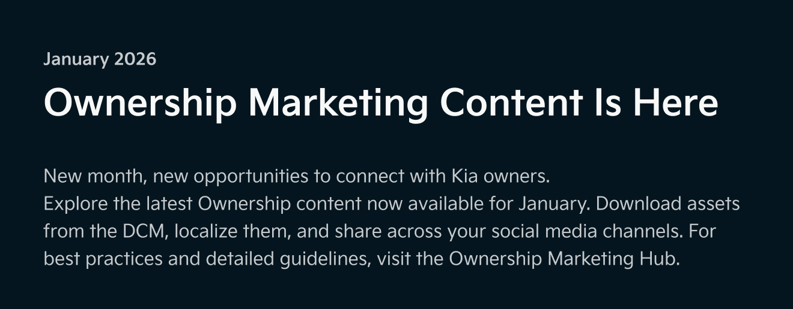

# Newsletter img

## 11월 발행 - 유진 테스트

<figure><figcaption></figcaption></figure>

<figure><figcaption></figcaption></figure> <figure><figcaption></figcaption></figure> <figure><figcaption></figcaption></figure>

<figure><figcaption></figcaption></figure> <figure><figcaption></figcaption></figure> <figure><figcaption></figcaption></figure>

<figure><figcaption></figcaption></figure> <figure><figcaption></figcaption></figure> <figure><figcaption></figcaption></figure>

<figure><figcaption></figcaption></figure> <figure><figcaption></figcaption></figure> <figure><figcaption></figcaption></figure>

<figure><figcaption></figcaption></figure> <figure><figcaption></figcaption></figure> <figure><figcaption></figcaption></figure>

<figure><figcaption></figcaption></figure> <figure><figcaption></figcaption></figure> <figure><figcaption></figcaption></figure>

<figure><figcaption></figcaption></figure> <figure><figcaption></figcaption></figure>

## 10월 발행

<figure><figcaption></figcaption></figure> <figure><figcaption></figcaption></figure> <figure><figcaption></figcaption></figure> <figure><figcaption></figcaption></figure>

## 9월 발행

<figure><figcaption></figcaption></figure> <figure><figcaption></figcaption></figure> <figure><figcaption></figcaption></figure> <figure><figcaption></figcaption></figure>

## Test

<figure><figcaption></figcaption></figure> <figure><figcaption></figcaption></figure> <figure><figcaption></figcaption></figure> <figure><figcaption></figcaption></figure> <figure><figcaption></figcaption></figure> <figure><figcaption></figcaption></figure> <figure><figcaption></figcaption></figure>

## Test - Img조각(2배)

<figure><figcaption></figcaption></figure> <figure><figcaption></figcaption></figure> <figure><figcaption></figcaption></figure> <figure><figcaption></figcaption></figure> <figure><figcaption></figcaption></figure> <figure><figcaption></figcaption></figure> <figure><figcaption></figcaption></figure> <figure><figcaption></figcaption></figure> <figure><figcaption></figcaption></figure> <figure><figcaption></figcaption></figure> <figure><figcaption></figcaption></figure> <figure><figcaption></figcaption></figure> <figure><figcaption></figcaption></figure> <figure><figcaption></figcaption></figure> <figure><figcaption></figcaption></figure> <figure><figcaption></figcaption></figure> <figure><figcaption></figcaption></figure> <figure><figcaption></figcaption></figure> <figure><figcaption></figcaption></figure> <figure><figcaption></figcaption></figure> <figure><figcaption></figcaption></figure> <figure><figcaption></figcaption></figure> <figure><figcaption></figcaption></figure>

v.2 11번 구분

<figure><figcaption></figcaption></figure> <figure><figcaption></figcaption></figure>

## Newsletter Test - 다크모드 (660px @2배수 추출)&#x20;

#### 01-공통 리소스: 로고

이미지 URL: [https://images.gitbook.com/\_\_img/dpr=2,width=2400,onerror=redirect,format=auto,signature=1513338626/https%3A%2F%2Ffiles.gitbook.com%2Fv0%2Fb%2Fgitbook-x-prod.appspot.com%2Fo%2Fspaces%252Fw5lfZjNS4U8oixK11ksH%252Fuploads%252FXetpfraBBVxnZxmgNWZb%252F01-logo.jpg%3Falt%3Dmedia%26token%3Dfe13a548-7c6e-4e32-89b4-bbadeb82b27f](https://images.gitbook.com/__img/dpr=2,width=2400,onerror=redirect,format=auto,signature=1513338626/https%3A%2F%2Ffiles.gitbook.com%2Fv0%2Fb%2Fgitbook-x-prod.appspot.com%2Fo%2Fspaces%2Fw5lfZjNS4U8oixK11ksH%2Fuploads%2FXetpfraBBVxnZxmgNWZb%2F01-logo.jpg%3Falt%3Dmedia%26token%3Dfe13a548-7c6e-4e32-89b4-bbadeb82b27f)

#### 02-KV 이미지&#x20;

<figure><figcaption></figcaption></figure>

* 11월&#x20;
  * URL: [https://images.gitbook.com/\_\_img/dpr=2,width=2400,onerror=redirect,format=auto,signature=-673304902/https%3A%2F%2Ffiles.gitbook.com%2Fv0%2Fb%2Fgitbook-x-prod.appspot.com%2Fo%2Fspaces%252Fw5lfZjNS4U8oixK11ksH%252Fuploads%252FX4TfSGBdoriq16qUemqd%252F02-img-tasman.jpg%3Falt%3Dmedia%26token%3D62a57603-d27b-4ef8-bc88-b1e68f97258f](https://images.gitbook.com/__img/dpr=2,width=2400,onerror=redirect,format=auto,signature=-673304902/https%3A%2F%2Ffiles.gitbook.com%2Fv0%2Fb%2Fgitbook-x-prod.appspot.com%2Fo%2Fspaces%2Fw5lfZjNS4U8oixK11ksH%2Fuploads%2FX4TfSGBdoriq16qUemqd%2F02-img-tasman.jpg%3Falt%3Dmedia%26token%3D62a57603-d27b-4ef8-bc88-b1e68f97258f)

#### 03- 본문 텍스트

<figure><figcaption></figcaption></figure>

* 11월
  * URL: [https://images.gitbook.com/\_\_img/dpr=2,width=2400,onerror=redirect,format=auto,signature=121195600/https%3A%2F%2Ffiles.gitbook.com%2Fv0%2Fb%2Fgitbook-x-prod.appspot.com%2Fo%2Fspaces%252Fw5lfZjNS4U8oixK11ksH%252Fuploads%252FoG8bPm4AfxB2ekZbotpT%252F03-text.jpg%3Falt%3Dmedia%26token%3Db5277e67-f2b4-4065-99c7-d2111cd15813](https://images.gitbook.com/__img/dpr=2,width=2400,onerror=redirect,format=auto,signature=121195600/https%3A%2F%2Ffiles.gitbook.com%2Fv0%2Fb%2Fgitbook-x-prod.appspot.com%2Fo%2Fspaces%2Fw5lfZjNS4U8oixK11ksH%2Fuploads%2FoG8bPm4AfxB2ekZbotpT%2F03-text.jpg%3Falt%3Dmedia%26token%3Db5277e67-f2b4-4065-99c7-d2111cd15813)

#### 04-공통 리소스: Ownership Marketing Hub 버튼

<figure><figcaption></figcaption></figure> <figure><figcaption></figcaption></figure> <figure><figcaption></figcaption></figure>

* URL (좌측부터)
  * [https://images.gitbook.com/\_\_img/dpr=2,width=2400,onerror=redirect,format=auto,signature=-403456806/https%3A%2F%2Ffiles.gitbook.com%2Fv0%2Fb%2Fgitbook-x-prod.appspot.com%2Fo%2Fspaces%252Fw5lfZjNS4U8oixK11ksH%252Fuploads%252FlwktUCeAvN0Skc1NfgkK%252F04-1.jpg%3Falt%3Dmedia%26token%3D21e12c13-d0ac-4bac-9fa3-e10c57319460](https://images.gitbook.com/__img/dpr=2,width=2400,onerror=redirect,format=auto,signature=-403456806/https%3A%2F%2Ffiles.gitbook.com%2Fv0%2Fb%2Fgitbook-x-prod.appspot.com%2Fo%2Fspaces%2Fw5lfZjNS4U8oixK11ksH%2Fuploads%2FlwktUCeAvN0Skc1NfgkK%2F04-1.jpg%3Falt%3Dmedia%26token%3D21e12c13-d0ac-4bac-9fa3-e10c57319460)
  * [https://images.gitbook.com/\_\_img/dpr=2,width=2400,onerror=redirect,format=auto,signature=-1922636328/https%3A%2F%2Ffiles.gitbook.com%2Fv0%2Fb%2Fgitbook-x-prod.appspot.com%2Fo%2Fspaces%252Fw5lfZjNS4U8oixK11ksH%252Fuploads%252FIq9LvBaaCY0e0GQR7WE1%252F04-2-button.jpg%3Falt%3Dmedia%26token%3D69ce491e-728b-4415-9b5e-aab8bda3a2e0](https://images.gitbook.com/__img/dpr=2,width=2400,onerror=redirect,format=auto,signature=-1922636328/https%3A%2F%2Ffiles.gitbook.com%2Fv0%2Fb%2Fgitbook-x-prod.appspot.com%2Fo%2Fspaces%2Fw5lfZjNS4U8oixK11ksH%2Fuploads%2FIq9LvBaaCY0e0GQR7WE1%2F04-2-button.jpg%3Falt%3Dmedia%26token%3D69ce491e-728b-4415-9b5e-aab8bda3a2e0)
  * [https://images.gitbook.com/\_\_img/dpr=2,width=2400,onerror=redirect,format=auto,signature=79667709/https%3A%2F%2Ffiles.gitbook.com%2Fv0%2Fb%2Fgitbook-x-prod.appspot.com%2Fo%2Fspaces%252Fw5lfZjNS4U8oixK11ksH%252Fuploads%252F3ryvTqHV4ATKSQ4ThIN4%252F04-3.jpg%3Falt%3Dmedia%26token%3De24c0453-4f31-443d-bf12-215184144cb2](https://images.gitbook.com/__img/dpr=2,width=2400,onerror=redirect,format=auto,signature=79667709/https%3A%2F%2Ffiles.gitbook.com%2Fv0%2Fb%2Fgitbook-x-prod.appspot.com%2Fo%2Fspaces%2Fw5lfZjNS4U8oixK11ksH%2Fuploads%2F3ryvTqHV4ATKSQ4ThIN4%2F04-3.jpg%3Falt%3Dmedia%26token%3De24c0453-4f31-443d-bf12-215184144cb2)

ㄱ

